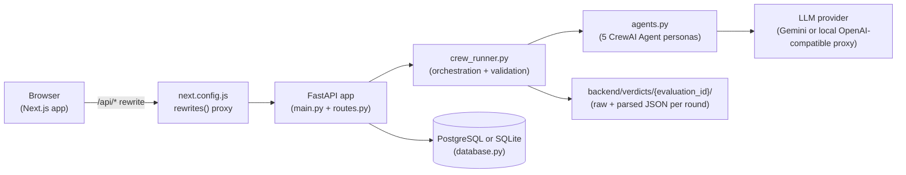

# Architecture

## System overview

Evalia is a single-tenant, unauthenticated, sequential multi-agent interview
evaluation pipeline. A Next.js frontend collects a resume and candidate
answers; a FastAPI backend orchestrates five CrewAI agent invocations
against an LLM provider, validates every agent's output against a strict
Pydantic schema, and persists results in PostgreSQL (production) or SQLite
(local development fallback).



There is no authentication, no multi-tenancy, and no durable job queue.
Every HTTP request that triggers an agent call blocks on that call inside
the request/response cycle (offloaded to a worker thread so it doesn't block
the event loop, but not queued or resumable — see
[GAP_ANALYSIS.md](GAP_ANALYSIS.md) P2). This is an accurate description of
the current implementation, not a simplification.

## The five-agent pipeline

| Stage | Round | Agent (`agents.py`) | Input (AGENT CONTEXT) | Output | Failure behavior |
|---|---|---|---|---|---|
| 1 | Screening | Senior Technical Recruiter | Resume + target role | `ScreeningVerdict` (PASS/BORDERLINE/FAIL) | FAIL → evaluation `REJECTED` immediately |
| 2 | Technical | Senior Technical Interviewer | Resume + round 1 verdict (question gen); + candidate answer (evaluation) | Questions (free text), then `TechnicalVerdict` (PASS/FAIL) | FAIL → `REJECTED` |
| 3 | Behavioral | Engineering Manager — Behavioral Interviewer | Resume + rounds 1–2 verdicts (question gen); + candidate answer (evaluation) | Question (free text), then `BehavioralVerdict` (PASS/BORDERLINE/FAIL) | FAIL → `REJECTED` |
| 4 | Hiring Recommendation | Senior Hiring Manager | Rounds 1–3 verdicts **only** (no resume, no raw answers) | `HiringRecommendation` (HIRE/HOLD/REJECT) | Invalid output → HTTP 502, `INVALID_OUTPUT` recorded |
| 5 | Committee Decision | Hiring Committee Chair | Rounds 1–3 verdicts + round 4 recommendation **only** (no resume, no raw answers) | `CommitteeDecision` (HIRE/HOLD/REJECT) — this is `final_decision` | Invalid output → HTTP 502, `INVALID_OUTPUT` recorded |

Rounds 1–3 are triggered by `POST /start`, `POST /round/2/answer`, and
`POST /round/3/answer` respectively. Rounds 4 and 5 both run inside a single
`GET /final-decision` call — there is no separate endpoint for round 4. This
means a successful pipeline run involves **seven** CrewAI `Crew.kickoff()`
executions in total: screening, technical-question-generation,
technical-evaluation, behavioral-question-generation,
behavioral-evaluation, recommendation, committee — not five, even though
there are five agent *personas*. This distinction matters for cost/latency
accounting (see [GAP_ANALYSIS.md](GAP_ANALYSIS.md) "efficiency" items).

### Bias isolation ("AGENT CONTEXT" principle)

Context is passed explicitly, function-argument by function-argument, in
`crew_runner.py` — there is no shared memory or automatic context
propagation between agents. Concretely:

- The **Committee** agent (round 5) receives only the text of rounds 1–4's
  verdict files (`verdicts/{evaluation_id}/round1.txt` … `round4.txt`). It
  never receives the resume text or the candidate's raw answers.
- The **Recommendation** agent (round 4) receives only rounds 1–3's verdict
  text, not the resume or raw answers either.
- Each earlier round's agent *does* see the resume and all prior verdicts,
  by design (a technical interviewer needs the resume to ask relevant
  questions).

This is a genuine, verifiable architectural property (you can grep
`crew_runner.py`'s `run_hiring_committee`/`run_hiring_recommendation` and see
that only `_read_verdict(...)` calls are passed in, no `resume` parameter).
What it does **not** do: remove indirect bias. Earlier verdicts can still
contain paraphrased resume content, and the committee is not an independent
re-derivation from evidence — see `CODEBASE_REVIEW.md`'s "Q01" finding and
[GAP_ANALYSIS.md](GAP_ANALYSIS.md) P3 (evidence/rubric harness — not
implemented).

## The "three memory types" model

The original README described three memory types; here is what each one
concretely is today:

| Type | Claimed purpose | Actual implementation |
|---|---|---|
| Session context | "Current interview session state" | **Does not exist as a separate concept any more.** `state.py` now holds only static constants (`AVAILABLE_ROLES`, `PIPELINE_STAGES`) and a per-evaluation verdict-directory helper. All session/lifecycle state lives in the `evaluations` table (see [DATA_MODEL.md](DATA_MODEL.md)), keyed by `evaluation_id`. This was a deliberate fix for a real bug (see below) — there is intentionally no process-global mutable session dictionary any more. |
| Decision memory | "Persistent agent verdicts & evaluation logs" | Real, and evaluation-scoped: `backend/verdicts/{evaluation_id}/round{N}.txt` (raw LLM text) and `round{N}.json` (validated, structured verdict) plus the `agent_verdicts` SQL table, which is the actual source of truth read by every API response. The flat files are a debugging/audit convenience, not queried by the API. |
| Agent context | "Explicit passing" | Real — see "Bias isolation" above. Every `run_*` function in `crew_runner.py` takes exactly the arguments it's allowed to see; there is no hidden global lookup. |

### Why "session context" changed

An earlier version of this codebase had a single process-global
`interview_state` dictionary in `state.py`, and `routes.py` imported that
dictionary object directly. `state.py`'s `reset_state()` function rebuilt
the dictionary with a **new object** (`interview_state = {...}`) instead of
mutating the existing one in place. Because `routes.py` had already bound a
reference to the *old* object at import time, every route that thought it
was writing to "the" session state was actually writing to an abandoned
object that `get_state()` would never read again. This was reproduced
directly (see `CODEBASE_REVIEW.md` finding B01) and is exactly the kind of
bug that a single evaluation-scoped database row structurally cannot have.
It is also why there is no in-memory session step left in this diagram —
removing the shared mutable object removed the entire bug class, not just
this one instance of it.

## LLM provider configuration

`agents.py` defines a single `LLM_MODEL` constant used by all five agents.
As of this documentation pass, the file contains **two** assignments to
`LLM_MODEL`:

```python
LLM_MODEL = "gemini/gemini-2.5-flash"

LLM_MODEL = LLM(
    model="openai/gpt-5.6-luna",
    base_url="http://127.0.0.1:9999/v1",
    api_key=os.getenv("COPILOT_PROXY_API_KEY", "not-needed"),
    custom_openai=True,
)
```

The **second assignment wins** — Evalia currently talks to a local,
OpenAI-compatible proxy at `http://127.0.0.1:9999/v1`, not Gemini, despite
the `GEMINI_API_KEY` environment variable and all of the Gemini-specific
naming elsewhere in the codebase (README text, `main.py` startup warning,
`requirements.txt`'s `crewai[google-genai]` extra). **This is intentional**
(added at the request of whoever is running this instance locally against a
VS Code extension-hosted proxy on port 9999), but it means:

- Anyone deploying this code as-is, expecting Gemini, will silently talk to
  `127.0.0.1:9999` instead and get connection errors in any environment
  without that proxy running.
- To restore Gemini, delete/comment out the second `LLM_MODEL = LLM(...)`
  block.
- `crewai`'s `LLM(model="openai/...", base_url=..., custom_openai=True)`
  forces the native OpenAI-compatible provider regardless of the model name,
  which is why an arbitrary model string like `gpt-5.6-luna` works against a
  non-OpenAI backend as long as that backend implements the
  `/v1/chat/completions` wire format.

See [GAP_ANALYSIS.md](GAP_ANALYSIS.md) for the recommended follow-up
(externalize this as an environment-driven choice instead of a hardcoded
second assignment).

## Request lifecycle for a mutating endpoint

Using `POST /round/2/answer` as the representative example:

1. `routes.py` validates the request body against `models.AnswerRequest`
   (FastAPI/Pydantic — length-bounded, non-empty after `.strip()`).
2. `_db(db.get_evaluation, evaluation_id)` loads the evaluation row via
   `asyncio.to_thread` (keeps the synchronous `sqlite3`/`psycopg2` call off
   the event loop — see [GAP_ANALYSIS.md](GAP_ANALYSIS.md) for the "not
   durable" caveat this doesn't solve).
3. Guard checks, in order: evaluation exists (404) → status is
   `IN_PROGRESS` (400) → `current_round == 2` (409) → no canonical round-2
   verdict already exists (409).
4. The answer is persisted (`db.save_answer`).
5. `crew_runner.run_technical_evaluation(...)` runs the CrewAI crew in a
   worker thread, parses the JSON output, and validates it against
   `TechnicalVerdict`. Any failure raises `AgentOutputError` — caught in
   `routes.py`, recorded as a `decision="INVALID_OUTPUT"` verdict row (which
   is exempt from the canonical-uniqueness constraint, so a retry is still
   possible), and surfaced to the client as HTTP 502. **It is never
   translated into PASS/FAIL.**
6. On success, `db.save_verdict(...)` persists the canonical verdict; a
   `DuplicateVerdictError` (from the partial unique index
   `uq_verdicts_canonical`) is translated to HTTP 409 if a concurrent
   request already committed a canonical verdict for this round.
7. On PASS, the behavioral question is generated (round 3) and
   `current_round` advances to 3. On FAIL, the evaluation is marked
   `REJECTED` and `final_decision="REJECT"` immediately.

Every mutating endpoint (`/start`, `/round/2/answer`, `/round/3/answer`,
`/final-decision`) follows this same shape: **load → guard → do the paid
work → validate → persist → respond**, with no step skipped and no silent
fallback substituted for a failed validation.

## Rate limiting

`main.py` wires in `rate_limit.InMemoryRateLimitMiddleware` (added in this
documentation/hardening pass — see [CHANGELOG.md](CHANGELOG.md)): a
fixed-window, per-client-IP request counter held in process memory,
defaulting to 60 requests per 60-second window per IP, configurable via
`RATE_LIMIT_REQUESTS` / `RATE_LIMIT_WINDOW_SECONDS`, and disabled entirely
when `RATE_LIMIT_REQUESTS=0`. This is deliberately simple and **is not** a
distributed rate limiter — running more than one backend process/instance
means each one enforces its own independent limit. See
[SECURITY.md](SECURITY.md) for the full honest scope of this control.

## Frontend architecture

Next.js 14 App Router. Pages relevant to the interview flow:

- `app/interview/page.tsx` — role selection + resume submission, calls
  `POST /api/start` (proxied to the backend's `POST /start`).
- `app/round/[id]/page.tsx` — technical/behavioral answer submission for the
  current round, keyed off a browser-`sessionStorage`-held `evaluation_id`.
- `app/result/page.tsx` — final decision + per-round verdict cards, calls
  `GET /api/final-decision`.
- `app/dashboard/page.tsx` and `app/dashboard/[id]/page.tsx` — evaluation
  list and detail views.

`next.config.js` rewrites `/api/*` to `${BACKEND_URL}/*` (default
`http://127.0.0.1:8000`). This is routing only — it does not add
authentication or authorization, and any client that can reach the FastAPI
port directly bypasses it entirely.

## What this architecture deliberately does not include

Documented explicitly here so it is not confused with an oversight:

- No authentication/authorization of any kind (see [SECURITY.md](SECURITY.md)).
- No multi-tenancy — every evaluation is visible to every API caller.
- No durable job queue — a crashed backend process during an agent call
  loses that in-flight request (the database row survives at whatever state
  it was last updated to, but the request itself must be retried by the
  client).
- No schema migration framework — `database.py` uses `CREATE TABLE IF NOT
  EXISTS` executed at every startup, not versioned migrations.
- No observability/tracing platform integration (structured `logging` calls
  only).
- No evaluation harness / benchmark dataset for grading the agents
  themselves (only structural/schema validation of their output, via
  Pydantic).

Each of these is tracked with more detail and rationale in
[GAP_ANALYSIS.md](GAP_ANALYSIS.md).
