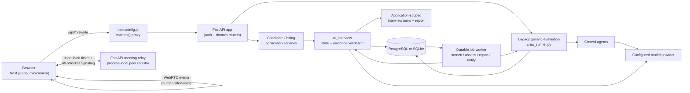

# Architecture

## System overview

database-backed jobs, a candidate-facing text interview, and recruiter-scoped
evidence reports. PostgreSQL is the production target; SQLite is used for
Evalia is a multi-tenant candidate/recruiter hiring platform with two distinct
evaluation paths: the legacy generic five-stage evaluation, and an
application-rooted screening plus persisted AI and human interviews. The
application path uses a deterministic FastAPI state controller, durable
database-backed jobs, browser speech recognition for AI interview answers,
evidence reports, and recruiter-owned stage decisions. Scheduled human rounds
use authenticated in-app WebRTC calls with independent panel scorecards.
PostgreSQL is the production target; SQLite is used for local development and
most automated tests.

The legacy generic evaluation retains its owner/org access plus token-gated
anonymous sandbox and is not the application pipeline. Its older synchronous
routes remain for compatibility. Application screening, answer assessment,
report generation, and candidate notification use the durable worker and
`background_jobs`; the job payload carries IDs, while candidate evidence is
loaded from application-scoped storage. Reminder, expiry, report-ready,
daily-digest, interview-scheduled, and panel-scorecard-ready notifications use
the same durable worker. See [AI_INTERVIEW_ARCHITECTURE_PLAN.md](AI_INTERVIEW_ARCHITECTURE_PLAN.md)
and [SECURITY.md](SECURITY.md) for the implemented boundary and outstanding
release requirements.

## Application screening and AI interview

`POST /jobs/{posting_id}/apply` requires a ready profile, freezes profile and
application-answer evidence, snapshots the posting criteria, and commits the
application, `application_ai_interviews` row, and idempotent screening job in
one transaction. A durable worker runs the structured screening call; code
validates exact source quotes, required evidence, posting constraints, and the
configured threshold. Only a validated clear pass advances the application to
`AI_INTERVIEW`, prepares the interview, and queues a notification. Unclear
evidence and execution failures are routed to `REVIEW_REQUIRED`; the model
cannot reject or make a hiring decision.

difficulty is persisted in `application_ai_interview_turns`. Report generation
Recruiter-set minimum experience and must-have skill checks are applied before
the model evidence screen. Explicit below-minimum or unclear cases enter a
human-review queue; the system does not auto-reject. A clear pass creates a
seven-day AI interview invitation, delayed reminder/expiry jobs, and an entry
in the single candidate `/interviews` agenda without per-candidate recruiter
scheduling.

The AI interviewer presents questions as text. The candidate speaks and the
browser SpeechRecognition API transcribes the answer into live captions; the
candidate submits the transcript as a voice-sourced turn. The existing server
state machine performs structured assessment and produces the next question.
The camera is not requested. A text-answer accommodation remains available.
Evalia persists transcript text and answer source, not raw audio. Browser
speech recognition itself is a browser/provider service and is not represented
as a managed Evalia STT stream.

Report publication atomically stores per-competency scores, interview and
screening evidence, job-requirement coverage, resume/profile claim checks,
strengths, concerns, next-round focus, and a deterministic advisory fit band.
The band is uncalibrated and never advances or rejects a candidate. A recruiter
must promote, hold, or reject with a reason. Promotion to a human round picks a
future time and assigned teammate(s) in the same transaction as the application
stage change.

## In-app human interviews and scorecards

The human call page requests camera and microphone only after the user joins.
Authenticated participants receive room-scoped, two-minute JWT tickets. A
FastAPI WebSocket relay forwards only SDP offers/answers and ICE candidates;
the media is peer-to-peer and is not stored by Evalia. The relay's peer registry
is process-local. STUN is the development fallback. When backend-only
`TURN_URLS` and `TURN_SHARED_SECRET` are configured, the API adds coturn
REST/HMAC credentials bound to the user and room with a 10-minute TTL; the
shared secret is never sent to the browser. Production still needs a deployed
TURN service, sticky routing or shared signaling, and multi-network validation
before the call is considered production-ready.

Each assigned interviewer submits an independent anchored scorecard.
Individual ratings remain hidden from peers and recruiters until all assigned
interviewers have submitted; then the combined panel view is available. The
application returns to `PENDING_REVIEW` and the recruiter decides the next
round, offer, hold, or rejection. Recruiter and interviewer scorecard/API
access remains scoped by org and explicit assignment.

## Legacy generic five-agent pipeline

| Stage | Round | Agent (`agents.py`) | Input (AGENT CONTEXT) | Output | Failure behavior |
|---|---|---|---|---|---|
| 1 | Screening | Senior Technical Recruiter | Resume + target role | `ScreeningVerdict` (PASS/BORDERLINE/FAIL) | FAIL → evaluation `REJECTED` immediately |
| 2 | Technical | Senior Technical Interviewer | Resume + round 1 verdict (question gen); + candidate answer (evaluation) | Questions (free text), then `TechnicalVerdict` (PASS/FAIL) | FAIL → `REJECTED` |
| 3 | Behavioral | Engineering Manager — Behavioral Interviewer | Resume + rounds 1–2 verdicts (question gen); + candidate answer (evaluation) | Question (free text), then `BehavioralVerdict` (PASS/BORDERLINE/FAIL) | FAIL → `REJECTED` |
| 4 | Hiring Recommendation | Senior Hiring Manager | Rounds 1–3 verdicts **only** (no resume, no raw answers) | `HiringRecommendation` (HIRE/HOLD/REJECT) | Invalid output → HTTP 502, `INVALID_OUTPUT` recorded |
| 5 | Committee Decision | Hiring Committee Chair | Rounds 1–3 verdicts + round 4 recommendation **only** (no resume, no raw answers) | `CommitteeDecision` (HIRE/HOLD/REJECT) — this is `final_decision` | Invalid output → HTTP 502, `INVALID_OUTPUT` recorded |

Rounds 1–3 are triggered by `POST /start`, `POST /round/2/answer`, and
`POST /round/3/answer` respectively. Rounds 4 and 5 both run inside a single
`GET /final-decision` call — there is no separate endpoint for round 4. This
means a successful pipeline run involves **seven** CrewAI `Crew.kickoff()`
executions in total: screening, technical-question-generation,
technical-evaluation, behavioral-question-generation,
behavioral-evaluation, recommendation, committee — not five, even though
there are five agent *personas*. This distinction matters for cost/latency
accounting (see [GAP_ANALYSIS.md](GAP_ANALYSIS.md) "efficiency" items).

### Bias isolation ("AGENT CONTEXT" principle)

Context is passed explicitly, function-argument by function-argument, in
`crew_runner.py` — there is no shared memory or automatic context
propagation between agents. Concretely:

- The **Committee** agent (round 5) receives only the text of rounds 1–4's
  verdict files (`verdicts/{evaluation_id}/round1.txt` … `round4.txt`). It
  never receives the resume text or the candidate's raw answers.
- The **Recommendation** agent (round 4) receives only rounds 1–3's verdict
  text, not the resume or raw answers either.
- Each earlier round's agent *does* see the resume and all prior verdicts,
  by design (a technical interviewer needs the resume to ask relevant
  questions).

This is a genuine, verifiable architectural property (you can grep
`crew_runner.py`'s `run_hiring_committee`/`run_hiring_recommendation` and see
that only `_read_verdict(...)` calls are passed in, no `resume` parameter).
What it does **not** do: remove indirect bias. Earlier verdicts can still
contain paraphrased resume content, and the committee is not an independent
re-derivation from evidence — see `CODEBASE_REVIEW.md`'s "Q01" finding and
[GAP_ANALYSIS.md](GAP_ANALYSIS.md) P3 (evidence/rubric harness — not
implemented).

## The "three memory types" model

The original README described three memory types; here is what each one
concretely is today:

| Type | Claimed purpose | Actual implementation |
|---|---|---|
| Session context | "Current interview session state" | There is no process-global mutable session dictionary. Legacy generic evaluation state lives in `evaluations`; the application-linked flow stores session/policy state in `application_ai_interviews` and ordered questions, answers, and assessments in `application_ai_interview_turns` (see [DATA_MODEL.md](DATA_MODEL.md)). |
| Decision memory | "Persistent agent verdicts & evaluation logs" | Real, and evaluation-scoped: `backend/verdicts/{evaluation_id}/round{N}.txt` (raw LLM text) and `round{N}.json` (validated, structured verdict) plus the `agent_verdicts` SQL table, which is the actual source of truth read by every API response. The flat files are a debugging/audit convenience, not queried by the API. |
| Agent context | "Explicit passing" | Real — see "Bias isolation" above. Every `run_*` function in `crew_runner.py` takes exactly the arguments it's allowed to see; there is no hidden global lookup. |

### Why "session context" changed

An earlier version of this codebase had a single process-global
`interview_state` dictionary in `state.py`, and `routes.py` imported that
dictionary object directly. `state.py`'s `reset_state()` function rebuilt
the dictionary with a **new object** (`interview_state = {...}`) instead of
mutating the existing one in place. Because `routes.py` had already bound a
reference to the *old* object at import time, every route that thought it
was writing to "the" session state was actually writing to an abandoned
object that `get_state()` would never read again. This was reproduced
directly (see `CODEBASE_REVIEW.md` finding B01) and is exactly the kind of
bug that a single evaluation-scoped database row structurally cannot have.
It is also why there is no in-memory session step left in this diagram —
removing the shared mutable object removed the entire bug class, not just
this one instance of it.

## LLM provider configuration

The CrewAI adapters in `backend/app/evaluation/agents.py` select a provider
from the process environment. By default they use
`gemini/gemini-2.5-flash` and `GEMINI_API_KEY`. Set `AGENT_MODEL` to choose a
different model; set both `AGENT_BASE_URL` and `AGENT_MODEL` to use an
OpenAI-compatible endpoint, with optional `AGENT_API_KEY` credentials. The
backend and worker must receive the same provider configuration and must be
able to reach the endpoint from their own runtime/container network.

The application interview's screening and answer-assessment adapters use
CrewAI behind durable worker jobs. The core question plan and state machine
are deterministic application code; CrewAI does not own application state,
authorization, or interview turn order. Automated tests mock model calls.
See [SETUP.md](SETUP.md) and `.env.example` for configuration. A configured
provider is not evidence of acceptable retention terms or validated hiring
quality; review those before sending real candidate data.

## Request lifecycle for a mutating endpoint

Using `POST /round/2/answer` as the representative example:

1. `routes.py` validates the request body against `models.AnswerRequest`
   (FastAPI/Pydantic — length-bounded, non-empty after `.strip()`).
2. `_db(db.get_evaluation, evaluation_id)` loads the evaluation row via
   `asyncio.to_thread` (keeps the synchronous `sqlite3`/`psycopg2` call off
   the event loop — see [GAP_ANALYSIS.md](GAP_ANALYSIS.md) for the "not
   durable" caveat this doesn't solve).
3. Guard checks, in order: evaluation exists (404) → status is
   `IN_PROGRESS` (400) → `current_round == 2` (409) → no canonical round-2
   verdict already exists (409).
4. The answer is persisted (`db.save_answer`).
5. `crew_runner.run_technical_evaluation(...)` runs the CrewAI crew in a
   worker thread, parses the JSON output, and validates it against
   `TechnicalVerdict`. Any failure raises `AgentOutputError` — caught in
   `routes.py`, recorded as a `decision="INVALID_OUTPUT"` verdict row (which
   is exempt from the canonical-uniqueness constraint, so a retry is still
   possible), and surfaced to the client as HTTP 502. **It is never
   translated into PASS/FAIL.**
6. On success, `db.save_verdict(...)` persists the canonical verdict; a
   `DuplicateVerdictError` (from the partial unique index
   `uq_verdicts_canonical`) is translated to HTTP 409 if a concurrent
   request already committed a canonical verdict for this round.
7. On PASS, the behavioral question is generated (round 3) and
   `current_round` advances to 3. On FAIL, the evaluation is marked
   `REJECTED` and `final_decision="REJECT"` immediately.

Every mutating endpoint (`/start`, `/round/2/answer`, `/round/3/answer`,
`/final-decision`) follows this same shape: **load → guard → do the paid
work → validate → persist → respond**, with no step skipped and no silent
fallback substituted for a failed validation.

## Rate limiting

`main.py` wires in `app.shared.rate_limit.InMemoryRateLimitMiddleware` (added in this
documentation/hardening pass — see [CHANGELOG.md](CHANGELOG.md)): a
sliding-window, per-client-IP request log held in process memory,
defaulting to 60 requests per 60-second window per IP, configurable via
`RATE_LIMIT_REQUESTS` / `RATE_LIMIT_WINDOW_SECONDS`, and disabled entirely
when `RATE_LIMIT_REQUESTS=0`. Expired per-IP buckets are periodically pruned.
This is deliberately simple and **is not** a
distributed rate limiter — running more than one backend process/instance
means each one enforces its own independent limit. See
[SECURITY.md](SECURITY.md) for the full honest scope of this control.

## Frontend architecture

Next.js 14 App Router. Pages relevant to the interview flow:

- `app/interview/page.tsx` — role selection + resume submission, calls
  `POST /api/start` (proxied to the backend's `POST /start`).
- `app/round/[id]/page.tsx` — technical/behavioral answer submission for the
  current round, keyed off a browser-`sessionStorage`-held `evaluation_id`.
- `app/result/page.tsx` — final decision + per-round verdict cards, calls
  `GET /api/final-decision`.
- `app/dashboard/page.tsx` and `app/dashboard/[id]/page.tsx` — evaluation
  list and detail views.

`next.config.js` rewrites `/api/*` to `${BACKEND_URL}/*` (default
`http://127.0.0.1:8000`). This is routing only — it does not add
authentication or authorization, and any client that can reach the FastAPI
port directly bypasses it entirely.

## Health and execution observability

`GET /healthz` is a process liveness probe and deliberately does not depend on
the database. `GET /readyz` returns `503` until application startup completes
and while a trivial database connectivity query fails. These endpoints are
safe for load-balancer and orchestrator checks; `GET /` remains an informational
service description.

The backend and standalone durable worker configure dependency-free JSON logs.
Worker lifecycle events include `job_id`, `evaluation_id` when present,
`trace_id` when present, stage, attempt, status, duration, cancellation state,
and typed error metadata. Job payloads, resumes, and answers are not emitted.
This is an initial operational boundary, not distributed tracing: request,
model, validator, database spans, usage/cost extraction, alerts, and an
external observability destination remain roadmap work.

## Schema evolution

Fresh databases are bootstrapped from the dialect-specific DDL in
`database.py`. Existing databases then run the ordered ledger in
`migrations.py`, recorded in `schema_migrations`. The current compatibility
migrations add execution metadata and tenant job fields, and make the
`CANCELLED` job state valid for both legacy SQLite and PostgreSQL tables while
preserving existing job rows. This ledger does not yet model question/answer
versions or normalized stage-attempt history.

## What this architecture deliberately does not include

Documented explicitly here so it is not confused with an oversight:

- No PostgreSQL row-level security; tenant and campaign-assignment checks are
  application-layer controls (see [SECURITY.md](SECURITY.md)).
- The public sandbox is intentionally anonymous but token-scoped; authenticated
  legacy evaluations require owner or active organization scope.
- Durable jobs are currently limited to finalization — a crashed backend
  process during screening, technical, behavioral, or inline finalization
  work still requires client retry. Finalization checkpoints and lease
  recovery prevent already-persisted recommendation/committee work from
  being recomputed unnecessarily.
- No complete stage-attempt/usage ledger — verdict rows retain execution
  provenance and optional provider usage JSON, but normalized attempt history,
  automatic usage extraction/cost accounting, and question/answer versions are
  still open.
- No distributed observability/tracing platform integration; JSON worker
  lifecycle events exist, but request/model/validator/database spans,
  usage/cost extraction, alerts, and an external destination are still open.
- No evaluation harness / benchmark dataset for grading the agents
  themselves (only structural/schema validation of their output, via
  Pydantic).

Each of these is tracked with more detail and rationale in
[GAP_ANALYSIS.md](GAP_ANALYSIS.md).
