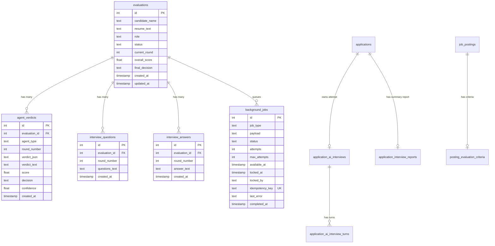

# Data model

Evalia supports two SQL dialects behind one code path (`database.py`):
**PostgreSQL** when `DATABASE_URL` is set, otherwise a local **SQLite** file
at `backend/evalia.db`. The schemas in `backend/app/config/` bootstrap fresh
databases, while `backend/app/config/migrations.py` applies ordered entries
recorded in `schema_migrations` for existing databases. Migrations 2–6 add
execution metadata, cancellable jobs, prep metadata, interview criteria/report
fields, and the persisted AI-interview turn allocator. This is a deliberately
small migration ledger, not a full Alembic-style migration framework.
Column names, types, and constraints are identical in intent between the
two dialects; only SQL syntax differs (`SERIAL` vs `AUTOINCREMENT`,
`TIMESTAMPTZ` vs `TEXT`, etc).

## `schema_migrations`

The ledger records each ordered migration exactly once. Version 1 marks the
pre-ledger baseline; version 2 adds execution metadata and tenant-aware job
fields; version 3 makes `CANCELLED` a valid durable-job state while preserving
legacy job rows and indexes; version 4 adds preparation-workspace metadata;
version 5 adds posting interview settings and report details; and version 6
adds `next_turn_sequence` to existing application interview sessions.
`init_db()` runs the ledger after the base schema and additive compatibility
helpers, so a restart is idempotent.

## Entity-relationship overview



## `background_jobs`

Durable work records currently back final recommendation and committee
execution. `idempotency_key` prevents duplicate admission; `tenant_key`
provides a persistence hook for tenant-aware scheduling; atomic claims set
`locked_by`/`locked_at` and increment `attempts`; an expired lease can be
reclaimed until `max_attempts` is reached. Jobs end in `COMPLETED`, `DEAD`, or
`CANCELLED`. Cancellation is durable: pending work is transitioned to
`CANCELLED`, and the worker checks the flag before and after handler execution
so a late result cannot complete a cancelled job. Cooperative cancellation of
an in-flight provider call, lease heartbeats, and manual dead-letter recovery
remain open. The table is not yet an attempt-history or usage ledger, and the
first three interview rounds are not admitted to it.

## `evaluations`

The root record for one candidate's run through the pipeline.

| Column | Type | Notes |
|---|---|---|
| `id` | serial/autoincrement PK | Referred to as `evaluation_id` everywhere else. |
| `candidate_name` | text, default `''` | Optional, free text. |
| `resume_text` | text, not null | **Sensitive.** Read only after owner/org authorization or matching the anonymous sandbox token; never selected by public-facing projections. |
| `access_token_hash` | text, nullable | Hash of the opaque token issued to an anonymous sandbox evaluation. The raw token is returned only at creation and stored in an HttpOnly cookie by the API. |
| `role` | text, not null | Must be one of `state.AVAILABLE_ROLES` at creation time (enforced in `routes.py`, not a DB constraint/enum). |
| `status` | text, default `'IN_PROGRESS'` | One of `IN_PROGRESS`, `COMPLETE`, `REJECTED` — enforced only in application code (`models.EvaluationStatus` enum exists but is not wired as a DB-level check constraint). |
| `current_round` | int, default `1` | 1–5. Advances only on a PASS/BORDERLINE canonical verdict for the current round. |
| `overall_score` | float, nullable | Set only by `/final-decision`; average of rounds 1–3's scores (see [API_REFERENCE.md](API_REFERENCE.md)). |
| `final_decision` | text, nullable | `HIRE`/`HOLD`/`REJECT`, or `REJECT` if rejected in an earlier round. |
| `created_at` / `updated_at` | timestamp | `updated_at` is set explicitly by `update_evaluation()` on every write — not a DB trigger. |

**Public projection.** `_EVALUATION_SUMMARY_COLUMNS` is a hardcoded column
list (everything except `resume_text` and `access_token_hash`) used by every
public list/detail query. Internal loading performs owner/org/token
authorization before the public projection is returned. This split is the
concrete fix for `CODEBASE_REVIEW.md` finding B04 (public exposure of raw
resumes).

## Hiring additions

`campaign_members` scopes plain recruiter access to assigned campaigns;
organization-wide roles can read the organization's campaigns. `invitations`
stores hashed, expiring one-time tokens. `interviews` and
`interview_participants` provide the initial scheduled-interview model with
organization, application, candidate, and interviewer links. Application-
linked AI interviews use the tables below and do not require per-candidate
meeting scheduling.

## Application-linked AI interviews

The first application-linked release is a **durable text interview**. It does
not persist audio/video, use a microphone, or connect to a speech provider.
Schema definitions are in `backend/app/config/ai_interview_schema.py`; the
posting criteria and one-row-per-application report schema is in
`backend/app/config/interview_criteria_schema.py`.

### `application_ai_interviews`

One row per application attempt, with a partial unique index preventing more
than one active attempt for an application. The row pins the posting rubric
version and full policy snapshot at application time, and stores screening
input/result, technical/behavioral core questions, current phase/question,
consent notice version/time, worker error state, lifecycle timestamps, and an
optional linked legacy `evaluations` row. The application and this row are
created together with the idempotent screening job in the application
transaction.

Session states include `SCREENING_QUEUED`, `SCREENING`, `REVIEW_REQUIRED`,
`INTERVIEW_READY`, `INTERVIEW_IN_PROGRESS`, `ANSWER_PROCESSING`,
`REPORT_PENDING`, `REPORT_READY`, `CANCELLED`, and `EXPIRED`. Screening passes
only when the typed assessment, exact source-quote checks, deterministic
posting constraints, and configured threshold all pass. Ambiguity, missing
evidence, invalid model output, or exhausted job retries is routed to human
review; the model cannot reject an applicant. Candidate-start consent records
acknowledgement of the versioned notice and the current `TEXT` modality.

### `application_ai_interview_turns`

One persisted question/answer/assessment per row. A unique
`(interview_id, sequence_no)` constraint and the session's monotonic
`next_turn_sequence` make turn ordering durable. `question_type` distinguishes
`CORE` from bounded `FOLLOW_UP`; `phase`, `competency_key`, and difficulty band
record technical/behavioral coverage. Answers are admitted once and assessed
by a durable job; an exact replay is idempotent, while a conflicting or
out-of-order answer is rejected.

### Posting criteria and `application_interview_reports`

`posting_evaluation_criteria` stores competencies, technical/behavioral
categories, pass threshold, role level, question counts, bounded follow-up
settings, and a rubric version. Each interview keeps the versioned policy
snapshot it used, so later posting edits do not rewrite an in-flight run.
`application_interview_reports` currently remains one row per application
(not per-session report history) and stores per-competency scores/evidence,
screening evidence, interview turns/provenance, the pinned rubric version, and
the human-review recommendation. The adaptive-path weighted total is
intentionally `NULL` until comparable paths have been calibrated. New AI
reports are advisory and do not make a hiring decision.

Candidate reads are scoped to their own application; recruiter reads require
organization capability and campaign assignment. PostgreSQL RLS policies
also cover the application, answer, session, and turn records. Withdrawal
cancels pending AI-interview work and clears the frozen screening input; a
comprehensive retention/expiry policy for completed reports and transcripts
is still an open product/security requirement.

## Preparation additions

The text-first preparation suite uses `prep_topics` and `prep_problems` as a
small curated catalog, `prep_roadmaps`/`prep_roadmap_nodes` for deterministic
user-owned plans, `prep_submissions` for unverified written practice, and
`prep_gamification`/`prep_xp_events` for transparent progress points. No
submitted code is executed by these tables or APIs; a provider-backed sandbox
must be selected and isolated before code execution is enabled.

## `agent_verdicts`

One row per agent execution attempt — including **failed** attempts.

| Column | Type | Notes |
|---|---|---|
| `id` | serial/autoincrement PK | |
| `evaluation_id` | FK → `evaluations.id`, `ON DELETE CASCADE` | |
| `agent_type` | text | `screening`, `technical`, `behavioral`, `recommendation`, `committee`. |
| `round_number` | int | 1–5. |
| `verdict_json` | text (JSON-encoded) | The full structured verdict object, or `{"error": "..."}` for a failed execution. |
| `verdict_text` | text, default `''` | Raw LLM output text (or the raw invalid text, for a failed execution) — kept for triage. |
| `score` | float, nullable | Null for round 5 (committee) and for failed executions. |
| `decision` | text, nullable | `PASS`/`FAIL`/`BORDERLINE`/`HIRE`/`HOLD`/`REJECT`, or the sentinel **`INVALID_OUTPUT`** for a failed agent execution. |
| `confidence` | float, nullable | Self-reported by the agent — see [SECURITY.md](SECURITY.md)/[GAP_ANALYSIS.md](GAP_ANALYSIS.md) for why this is not a calibrated probability. |
| `attempt_id` | text | Identifier generated for each persisted execution result or failure row. There is not yet a separate normalized attempt table. |
| `model_name` | text | Model/provider label supplied by the caller or `AGENT_MODEL_NAME`; defaults to `unspecified`. |
| `prompt_version` / `rubric_version` | text | Version labels supplied by the caller or environment; default to `unversioned` until explicitly configured. |
| `usage_json` | text (JSON-encoded) | Optional provider usage payload, decoded by repository reads. Automatic extraction and cost calculation are not implemented. |
| `error_type` | text, nullable | Typed failure classification such as `AgentOutputError`; null for successful verdicts. |
| `started_at` / `completed_at` | timestamp | Execution timing metadata; defaults to the persistence timestamp when the caller does not provide it. |
| `deployment_provenance` | text | Deployment/build label supplied by the caller or `DEPLOYMENT_PROVENANCE`; defaults to `local`. |
| `created_at` | timestamp | |

### The canonical-verdict uniqueness constraint

```sql
CREATE UNIQUE INDEX IF NOT EXISTS uq_verdicts_canonical
    ON agent_verdicts (evaluation_id, round_number)
    WHERE decision <> 'INVALID_OUTPUT';
```

This is a **partial unique index** (supported natively by both PostgreSQL
and SQLite): at most one *canonical* (non-`INVALID_OUTPUT`) verdict can
exist per `(evaluation_id, round_number)` pair, but any number of
`INVALID_OUTPUT` rows can accumulate for the same round — so a failed
execution never blocks a subsequent retry, but two concurrent successful
submissions for the same round can't both "win" (the loser gets
`database.DuplicateVerdictError`, translated to HTTP 409 in `routes.py`).
This is the concrete fix for `CODEBASE_REVIEW.md` finding B05 (unprotected
workflow transitions). Verified in
`backend/tests/test_database.py::TestCanonicalVerdictUniqueness`.

## `interview_questions` / `interview_answers`

Free-text storage for the generated question(s) and the candidate's raw
answer per round. No stable per-question ID — a whole round's questions are
stored as one text blob (as generated by the agent, typically a numbered
list), and a whole round's answer is stored as one text blob. This means
there is no way to associate a specific answer sentence with a specific
question programmatically; the evaluating agent does that association
itself, from the combined text. See [GAP_ANALYSIS.md](GAP_ANALYSIS.md) P3
for the roadmap's proposed fix (stable per-question IDs and answer
versions) — not implemented.

## Indexes

```sql
CREATE INDEX IF NOT EXISTS idx_verdicts_eval ON agent_verdicts(evaluation_id);
CREATE INDEX IF NOT EXISTS idx_questions_eval ON interview_questions(evaluation_id);
CREATE INDEX IF NOT EXISTS idx_answers_eval ON interview_answers(evaluation_id);
CREATE INDEX IF NOT EXISTS idx_evaluations_status ON evaluations(status);
```

All four support the query patterns actually used by `routes.py`/`database.py`
(per-evaluation lookups and status-filtered listing). There is no index on
`(evaluation_id, round_number)` beyond the partial unique index above,
which also serves lookup queries like `get_verdict_by_round`.

## Identity, tenancy & audit tables

Added in the platform foundation phase (see
[PRODUCT_BLUEPRINT.md](PRODUCT_BLUEPRINT.md)). DDL lives in
`_PG_IDENTITY_SCHEMA` / `_SQLITE_IDENTITY_SCHEMA`, kept separate from the
original interview-pipeline schema so the two can be reasoned about
independently.

| Table | Purpose | Notes |
|---|---|---|
| `organizations` | Tenant root | `slug` unique; `plan` exists now so billing can be added later without a schema change |
| `users` | Identity | `email_normalized` is the uniqueness key (casefolded). `password_hash` is bcrypt over a SHA-256 pre-hash |
| `roles` | Named capability bundles | Seeded from `rbac.SYSTEM_ROLES` on every startup |
| `role_capabilities` | Role → capability mapping | Re-synced on startup, so a code change takes effect without a manual migration |
| `org_memberships` | (user, org, role) | Partial unique index on `(org_id, user_id) WHERE deleted_at IS NULL` prevents duplicate active memberships |
| `invitations` | Tokenised org invites | Hashed, expiring create/list/accept flow; email delivery is best-effort |
| `audit_events` | Append-only audit log | Hash-chained via `prev_hash`/`hash` |

### Dual-persona identity

A user is **not** typed as either a candidate or a recruiter. Identity is one
row in `users`; being a recruiter is a row in `org_memberships`. A person can
hold both simultaneously — a candidate at one company and a recruiter at
their own employer. Modelling this as a `user.type` column would block that
case permanently, which is why it is deliberately absent.

### Audit hash chain

Each row stores the hash of the previous row. `database.verify_audit_chain()`
walks the chain and reports the first break, detecting both silent edits and
deletions. This is *tamper evidence*, not tamper proofing — see
[SECURITY.md](SECURITY.md).

### Evaluation tenancy retrofit

`evaluations` gained two **nullable** columns, `org_id` and `owner_user_id`,
applied by `_apply_additive_columns()` at startup for databases that predate
them. Nullable is deliberate: rows created before ownership existed cannot be
retroactively attributed, and inventing an owner would corrupt the audit
story. Unowned rows are treated as legacy.

This also preserves the pre-identity API contract — `POST /start` still works
without credentials and simply produces an unowned evaluation.

## Hiring domain tables

Added in Phase 1. DDL lives in
`backend/app/config/hiring_schema.py`; candidate and hiring data access are
split into `backend/app/candidate/repository.py` and
`backend/app/hiring/repository.py` so the central database module does not
grow without bound.

**Candidate vault:** `candidate_profiles`, `work_experiences`,
`education_entries`, `skill_claims`, `job_preferences`,
`answer_vault_entries`.

**Hiring:** `campaigns`, `job_postings`, `applications`,
`application_answers`, `application_events`.

### Constraints that encode product decisions

| Constraint | Why |
|---|---|
| `uq_application_candidate_posting` is a **partial** unique index excluding `withdrawn_at IS NOT NULL` | One live application per candidate per posting, but a candidate who withdrew can genuinely re-apply |
| `uq_vault_entry (profile_id, question_key)` | `question_key` is stable across organizations, which is what lets one company's question pre-fill for the next |
| `job_postings.auto_reject_enabled` defaults to **FALSE** | An automated employment decision is a regulated act. Orgs opt in explicitly and auditably — see [DECISIONS.md](DECISIONS.md) D-10 |
| `applications.profile_snapshot` | Immutable copy of the profile at submission. A candidate editing their profile later must not silently rewrite what a recruiter actually assessed |
| `skill_claims.verified` separate from the claim | Verified means demonstrated in-platform, never self-asserted. Kept distinct so matching can never conflate the two |
| `candidate_profiles.data_consent_at` / `retention_until` | Captured from day one. Consent cannot be obtained retroactively for data already held, so the columns must exist before the data does |

### Application state machine

Transitions are validated against an explicit table in
`backend/app/hiring/repository.py` rather
than being unconstrained, so a replayed or out-of-order request is rejected
instead of corrupting pipeline history. Terminal stages (`HIRED`, `REJECTED`,
`WITHDRAWN`) have no outward transitions.

`PENDING_REVIEW` is where uncertain screening evidence or a completed AI
interview report awaits human review. It can transition in either direction,
because the recruiter retains the application decision.

## Matching, sourcing & referrals (Phase 2)

Added in Phase 2. `matching.py` is pure/stateless (no I/O, exhaustively unit
testable) and produces a score plus a human-readable explanation for every
ranking — see [API_REFERENCE.md](API_REFERENCE.md) for the scoring model.

| Column | Table | Purpose |
|---|---|---|
| `candidate_profiles.is_discoverable` | Candidate opt-in | Only profiles with this set appear in recruiter talent-pool search. Enforced in the query itself so it cannot be bypassed by a route-layer bug |

**`referrals`** table: a recruiter referring a candidate (by email, matched
normalized — the candidate need not have an account yet) to a specific
posting. A partial unique index prevents a duplicate *open* referral for the
same candidate/posting pair, while a previously closed one does not block a
fresh referral.

### Why matching stays deterministic for now

`PRODUCT_BLUEPRINT.md §8.1` stages the matching engine deliberately:
deterministic scoring now, semantic (pgvector) similarity once there is
posting/profile volume to make it worth the infrastructure, and learned
ranking only once real outcome data exists to train on — which it does not
yet. Building Stage 3 now would mean training on nothing.

## Decision-memory files on disk

```
backend/verdicts/{evaluation_id}/round1.txt   # raw screening output
backend/verdicts/{evaluation_id}/round1.json  # validated ScreeningVerdict
backend/verdicts/{evaluation_id}/round2.txt
backend/verdicts/{evaluation_id}/round2.json
backend/verdicts/{evaluation_id}/round3.txt
backend/verdicts/{evaluation_id}/round3.json
backend/verdicts/{evaluation_id}/round4.txt
backend/verdicts/{evaluation_id}/round4.json
backend/verdicts/{evaluation_id}/committee.txt
backend/verdicts/{evaluation_id}/committee.json
```

These files are read back by later rounds in the same evaluation (e.g.
round 3's question generation reads `round1.txt` and `round2.txt` as plain
text context for the next agent call) — they are **not** just a debug
artifact, they are load-bearing for context assembly. They are also
`.gitignore`d (`verdicts/*.txt`, `verdicts/*.json`) so they should never be
committed; three stale, pre-existing tracked files under the old flat
`backend/verdicts/round{1,2,3}.txt` paths (predating the current
per-evaluation subdirectory scheme, and containing what appears to be a
real candidate's resume screening output) were removed from git tracking
during this documentation pass — see [CHANGELOG.md](CHANGELOG.md).
