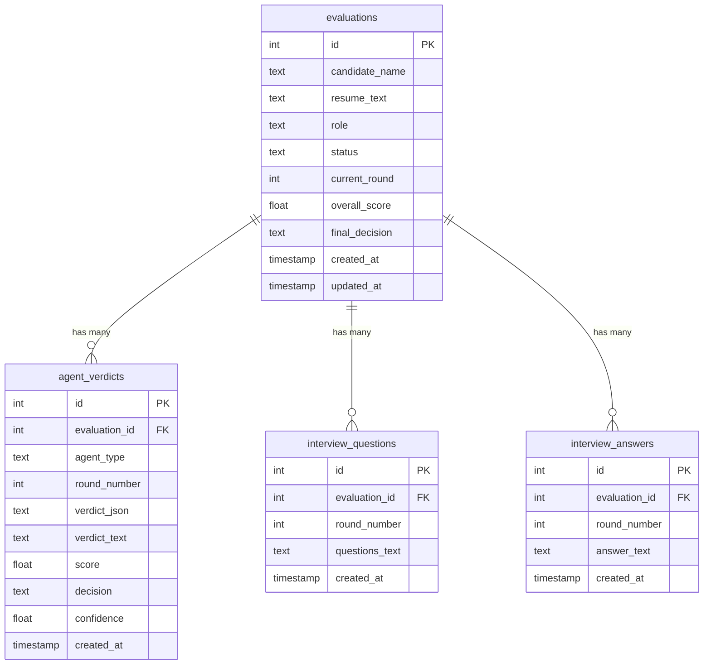

# Data model

Evalia supports two SQL dialects behind one code path (`database.py`):
**PostgreSQL** when `DATABASE_URL` is set, otherwise a local **SQLite** file
at `backend/evalia.db`. Both schemas are defined inline in `database.py`
(`_PG_SCHEMA` / `_SQLITE_SCHEMA`) as `CREATE TABLE IF NOT EXISTS` statements
executed by `init_db()` on every app startup — there is **no versioned
migration framework** (see [GAP_ANALYSIS.md](GAP_ANALYSIS.md) P1/T006).
Column names, types, and constraints are identical in intent between the
two dialects; only SQL syntax differs (`SERIAL` vs `AUTOINCREMENT`,
`TIMESTAMPTZ` vs `TEXT`, etc).

## Entity-relationship overview



## `evaluations`

The root record for one candidate's run through the pipeline.

| Column | Type | Notes |
|---|---|---|
| `id` | serial/autoincrement PK | Referred to as `evaluation_id` everywhere else. |
| `candidate_name` | text, default `''` | Optional, free text. |
| `resume_text` | text, not null | **Sensitive.** Only read via `get_evaluation` (internal). Never selected by any public-facing query — see `_EVALUATION_SUMMARY_COLUMNS`. |
| `role` | text, not null | Must be one of `state.AVAILABLE_ROLES` at creation time (enforced in `routes.py`, not a DB constraint/enum). |
| `status` | text, default `'IN_PROGRESS'` | One of `IN_PROGRESS`, `COMPLETE`, `REJECTED` — enforced only in application code (`models.EvaluationStatus` enum exists but is not wired as a DB-level check constraint). |
| `current_round` | int, default `1` | 1–5. Advances only on a PASS/BORDERLINE canonical verdict for the current round. |
| `overall_score` | float, nullable | Set only by `/final-decision`; average of rounds 1–3's scores (see [API_REFERENCE.md](API_REFERENCE.md)). |
| `final_decision` | text, nullable | `HIRE`/`HOLD`/`REJECT`, or `REJECT` if rejected in an earlier round. |
| `created_at` / `updated_at` | timestamp | `updated_at` is set explicitly by `update_evaluation()` on every write — not a DB trigger. |

**Public projection.** `_EVALUATION_SUMMARY_COLUMNS` is a hardcoded column
list (everything except `resume_text`) used by every list/detail query
reachable from the API. `get_evaluation()` (internal, includes
`resume_text`) is used only inside `routes.py` handlers that need to build
agent context — never returned directly to a client. This split is the
concrete fix for `CODEBASE_REVIEW.md` finding B04 (public exposure of raw
resumes).

## `agent_verdicts`

One row per agent execution attempt — including **failed** attempts.

| Column | Type | Notes |
|---|---|---|
| `id` | serial/autoincrement PK | |
| `evaluation_id` | FK → `evaluations.id`, `ON DELETE CASCADE` | |
| `agent_type` | text | `screening`, `technical`, `behavioral`, `recommendation`, `committee`. |
| `round_number` | int | 1–5. |
| `verdict_json` | text (JSON-encoded) | The full structured verdict object, or `{"error": "..."}` for a failed execution. |
| `verdict_text` | text, default `''` | Raw LLM output text (or the raw invalid text, for a failed execution) — kept for triage. |
| `score` | float, nullable | Null for round 5 (committee) and for failed executions. |
| `decision` | text, nullable | `PASS`/`FAIL`/`BORDERLINE`/`HIRE`/`HOLD`/`REJECT`, or the sentinel **`INVALID_OUTPUT`** for a failed agent execution. |
| `confidence` | float, nullable | Self-reported by the agent — see [SECURITY.md](SECURITY.md)/[GAP_ANALYSIS.md](GAP_ANALYSIS.md) for why this is not a calibrated probability. |
| `created_at` | timestamp | |

### The canonical-verdict uniqueness constraint

```sql
CREATE UNIQUE INDEX IF NOT EXISTS uq_verdicts_canonical
    ON agent_verdicts (evaluation_id, round_number)
    WHERE decision <> 'INVALID_OUTPUT';
```

This is a **partial unique index** (supported natively by both PostgreSQL
and SQLite): at most one *canonical* (non-`INVALID_OUTPUT`) verdict can
exist per `(evaluation_id, round_number)` pair, but any number of
`INVALID_OUTPUT` rows can accumulate for the same round — so a failed
execution never blocks a subsequent retry, but two concurrent successful
submissions for the same round can't both "win" (the loser gets
`database.DuplicateVerdictError`, translated to HTTP 409 in `routes.py`).
This is the concrete fix for `CODEBASE_REVIEW.md` finding B05 (unprotected
workflow transitions). Verified in
`backend/tests/test_database.py::TestCanonicalVerdictUniqueness`.

## `interview_questions` / `interview_answers`

Free-text storage for the generated question(s) and the candidate's raw
answer per round. No stable per-question ID — a whole round's questions are
stored as one text blob (as generated by the agent, typically a numbered
list), and a whole round's answer is stored as one text blob. This means
there is no way to associate a specific answer sentence with a specific
question programmatically; the evaluating agent does that association
itself, from the combined text. See [GAP_ANALYSIS.md](GAP_ANALYSIS.md) P3
for the roadmap's proposed fix (stable per-question IDs and answer
versions) — not implemented.

## Indexes

```sql
CREATE INDEX IF NOT EXISTS idx_verdicts_eval ON agent_verdicts(evaluation_id);
CREATE INDEX IF NOT EXISTS idx_questions_eval ON interview_questions(evaluation_id);
CREATE INDEX IF NOT EXISTS idx_answers_eval ON interview_answers(evaluation_id);
CREATE INDEX IF NOT EXISTS idx_evaluations_status ON evaluations(status);
```

All four support the query patterns actually used by `routes.py`/`database.py`
(per-evaluation lookups and status-filtered listing). There is no index on
`(evaluation_id, round_number)` beyond the partial unique index above,
which also serves lookup queries like `get_verdict_by_round`.

## Decision-memory files on disk

Independent of the SQL tables, `crew_runner.py` also writes:

```
backend/verdicts/{evaluation_id}/round1.txt   # raw screening output
backend/verdicts/{evaluation_id}/round1.json  # validated ScreeningVerdict
backend/verdicts/{evaluation_id}/round2.txt
backend/verdicts/{evaluation_id}/round2.json
backend/verdicts/{evaluation_id}/round3.txt
backend/verdicts/{evaluation_id}/round3.json
backend/verdicts/{evaluation_id}/round4.txt
backend/verdicts/{evaluation_id}/round4.json
backend/verdicts/{evaluation_id}/committee.txt
backend/verdicts/{evaluation_id}/committee.json
```

These files are read back by later rounds in the same evaluation (e.g.
round 3's question generation reads `round1.txt` and `round2.txt` as plain
text context for the next agent call) — they are **not** just a debug
artifact, they are load-bearing for context assembly. They are also
`.gitignore`d (`verdicts/*.txt`, `verdicts/*.json`) so they should never be
committed; three stale, pre-existing tracked files under the old flat
`backend/verdicts/round{1,2,3}.txt` paths (predating the current
per-evaluation subdirectory scheme, and containing what appears to be a
real candidate's resume screening output) were removed from git tracking
during this documentation pass — see [CHANGELOG.md](CHANGELOG.md).
