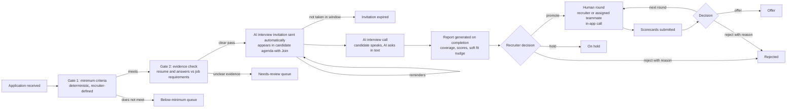
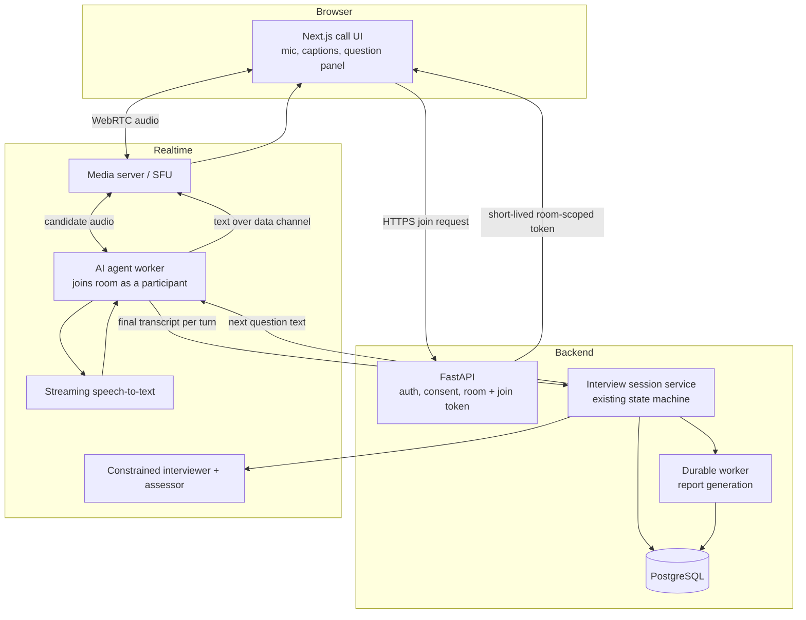

# Live AI interview call and human interview rounds: end-to-end plan

**Prepared:** 2026-10-01
**Prepared:** 2026-10-01 · **Implementation status:** Core hiring workflow implemented; production gates remain open.
**Revision 2:** Records the intended automatic application-to-report workflow and a future managed AI voice call. Since this plan was drafted, automatic screening/invitations, a candidate agenda, browser speech transcription, transcript correction, report/recruiter decisions, human WebRTC scheduling, team assignment, and panel scorecards have been implemented. The AI voice path is **not** a real-time AI participant in a media room: questions are text and speech recognition runs in the candidate's browser.
**Relationship to existing docs:** Read this as the original product/design brief, not a statement that every section is currently delivered. [AI_INTERVIEW_ARCHITECTURE_PLAN.md](AI_INTERVIEW_ARCHITECTURE_PLAN.md) and [TESTING.md](TESTING.md) record the current implementation and release limits. Human hiring decisions, authorization, consent, and evidence-grounding requirements still apply.

## 1. What you asked for, restated

1. The candidate joins an interview **inside this app**, in a call-style interface. No external meeting link.
2. An **AI agent joins that call** as the interviewer and interviews the candidate in real time.
3. Interaction mode, taken literally from your message:
   - The candidate **speaks** their answers in their natural voice. Voice is the answer channel.
   - The AI **asks questions as text** on screen. It does not speak.
   - The AI processes each spoken answer and posts the next question.
4. The AI produces a **report** for the recruiter.
5. The recruiter reads the report and decides whether to **promote** the candidate to the next round.
6. For later rounds, the recruiter **conducts the interview or assigns a teammate**.
7. The recruiter can **manage their team** (listed, with roles and availability) from their profile area.
8. **Revision 2:** the AI round must be automatic. When an application arrives, the system checks the recruiter's minimum criteria, then invites the candidate to the AI interview without any recruiter action. The interview runs, and a report is produced. The recruiter's report says how strong the candidate is on resume areas and on what the job description needs, and softly nudges whether the candidate fits.

The implemented candidate UI asks questions as text and supports either correctable browser speech-to-text answers or a text accommodation. It does not stream microphone audio to an Evalia speech service or put an AI agent in the human WebRTC room. The report/decision path, unified agenda, human rounds, and independent panel scorecards are now implemented; managed live voice and production validation remain open.

## 2. Product flow and the automated pipeline

### 2.1 Historical screenshot context and current entry points

The screenshot reflected the earlier application-only experience. The current `/interviews` agenda combines candidate-safe AI screening/invitation state with scheduled human calls and links an eligible candidate directly to the AI interview. The application tracker also provides a start/continue action. Human interviews use the separate scheduled `interviews` records; historical rows may still carry an optional external `meeting_url`.

The backend now queues screening on application submission, creates the interview-ready invitation and notifications on a clear evidence pass, schedules reminder/expiry jobs, and routes uncertainty/service failures to human review. Recruiters can re-invite an expired candidate, review the evidence report, and explicitly promote/hold/reject. A soft fit nudge is advisory and uncalibrated. A managed live speech/AI-call participant, production provider validation, and fuller policy/criteria configuration remain future work.

### 2.2 The pipeline, with no manual scheduling

| Step | Who acts | Trigger | Result |
|---|---|---|---|
| Application received | Candidate | Submit | A durable job starts. The application is queued for screening immediately. |
| Gate 1: minimum criteria | System | Job starts | Deterministic checks against the criteria the recruiter set for this posting (section 2.3). Each check records pass or fail with the fact it used. |
| Gate 2: evidence check | System | Gate 1 met | The existing evidence-cited screening confirms required skills and experience from the resume and answers. A claim without a quotable source is "unclear", not "failed". |
| Invitation | System | Both gates met | Application moves to `AI_INTERVIEW`. Candidate is notified in-app and by email. The interview appears in the candidate's agenda with a **Join** action. No recruiter click. |
| Reminders and expiry | System | Timer | Reminder before the window closes. After expiry the invitation is marked expired and the recruiter is told. A recruiter can re-invite in one click. |
| AI interview | Candidate and AI | Candidate joins | Section 4. |
| Report | System | Interview completes | Section 5. The application moves to `PENDING_REVIEW`. |
| Decision | Recruiter | Report ready | Promote, hold, or reject with a reason. |

The recruiter's regular work reduces to four things: set up the posting once, clear the two exception queues, read reports, and decide.

### 2.3 Minimum criteria set by the recruiter

The current posting policy carries required skills, minimum/maximum experience, a pass threshold, and screening questions. Deterministic checks cover structured minimum experience and required skills; missing or below-minimum evidence is routed to human review, never an automatic rejection. A complete deterministic comparator for location, work authorization, and arbitrary required application answers is not yet implemented.

| Criterion type | Examples | How it is checked |
|---|---|---|
| Must-have skills | "Python", "SQL" | Quoted evidence in resume, profile, or application answer. |
| Experience range | At least 4 years | Profile field first, cited evidence second. |
| Application questions with required answers | Work authorization, relocation, notice period | Exact answer comparison, no model involved. |
| Location or work mode | Onsite in a given city | Profile and posting fields. |
| Optional nice-to-haves | "Airflow" | Not a gate. Carried into the report coverage. |

Rules:

- Gate 1 uses only deterministic comparisons of recruiter-defined criteria. A model never decides a minimum-criteria failure.
- Missing information is treated as "unclear" and goes to the needs-review queue. It is never treated as a failure.
- Every gate result stores which criterion, which fact, and which value, so the recruiter and the candidate can see why.
- What happens when a candidate does not meet the minimum is decision D-13. The default keeps a human in the loop.
- Criteria are versioned. Each application is judged against the version in force when it was submitted.

### 2.4 One agenda for the candidate

`/interviews` is now the single candidate-facing agenda for current AI invitation/progress and scheduled human interviews:

- The AI interview invitation, with the window ("Join any time before 14 Oct, 18:00"), a **Join** button, an estimated duration, and a status (invited, in progress, completed, expired).
- Human round interviews with date, time, interviewer name, and **Join** inside the app once the window opens.
- Slot choices that need an answer.
- The same state is mirrored on the application card, so both places agree.

The external `meeting_url` field stays for legacy rows and is not used by new rounds (decision D-5).

### 2.5 Principles carried over

- The AI interviews and reports. It never advances, holds, or rejects anyone. Every stage change after the AI report is a human action with a recorded reason.
- Infrastructure failure, bad audio, or a transcription error is never scored against the candidate.
- Scoring uses **what was said** (transcript content). It does not use voice, accent, speaking rate, tone, emotion, or appearance.

## 3. What exists and what is reused

| Existing asset | Reuse in this plan |
|---|---|
| Interview session, turns, question plan, bounded follow-ups, answer assessment, report ([ai_interview](../backend/app/ai_interview/)) | Stays the deterministic brain. The call only changes how an answer arrives (speech-to-text instead of a textarea) and how a question is shown. |
| Durable job worker, notifications inbox, idempotency | Report generation, "AI interview ready" and "you were assigned" notifications. |
| Org memberships, invitations, roles incl. `interviewer` and `hiring_manager`, capabilities `INTERVIEW_CONDUCT`, `INTERVIEW_READ_ASSIGNED` ([rbac.py](../backend/app/shared/rbac.py)) | Basis for team management and assignment. |
| `campaign_members`, `interviews`, `interview_participants` tables ([hiring_schema.py](../backend/app/config/hiring_schema.py)) | Extended. `interviews.meeting_url` becomes an in-app room instead of an external URL. |
| Application stages incl. `AI_INTERVIEW`, `TECHNICAL`, `BEHAVIORAL`, `INTERVIEW`, `PENDING_REVIEW`, human-override rules ([repository.py](../backend/app/hiring/repository.py)) | Starting point for rounds. Section 7 proposes configurable rounds on top. |
| Org members/invite/role routes, [org page](../frontend/app/org/page.tsx) | Starting point for the Team surface. Today it only invites; there is no team directory. |
| Candidate [interviews page](../frontend/app/interviews/page.tsx) | Becomes the "Join" entry point alongside the application tracker. |
| Postgres RLS and request context | New tables follow the same tenant and owner policies. |

Still not present: a managed streaming speech-to-text/audio service, an AI agent participating in the human WebRTC room, text-to-speech, automatic human-call transcription, and provider reconnect/recovery. The implemented browser speech recognition is separate from the human-call WebRTC transport. Team directory/availability, interviewer assignment, scorecards, and recruiter decision actions are implemented in their own human-round workflow.

## 4. The AI interview call

### 4.1 Candidate experience

1. **Entry.** The invitation appears in the candidate agenda at `/interviews` and on the application card as soon as the pipeline invites them (section 2.4). **Join** is available throughout the invitation window. The window and expiry come from the posting policy (decision D-11).
2. **Lobby.**
   - Plain statement that the interviewer is an AI.
   - What is captured (transcript; audio only if the pilot approves it) and for how long.
   - Consent checkbox, recorded with the notice version.
   - Microphone permission and a live level meter.
   - A short "say a sentence" check that shows the recognized text, so the candidate knows speech is understood before the interview starts.
3. **In the call.** Layout, similar to a meeting app:
   - **AI interviewer tile** with state labels: "Listening", "Thinking", "Question ready".
   - **Question panel**: the current question as large text, with competency and question number (for example 3 of 8).
   - **Live captions** of what the candidate is saying, so they can see what the system heard.
   - **Controls**: mute, "I'm done answering", "Repeat question", "Rephrase question", "I need a moment" (pauses the answer timer), "End interview".
   - Optional self-view if the camera is on. Default is audio only (decision D-1).
4. **Turn loop.** The AI posts a question as text. The candidate speaks. End of answer is detected by silence (configurable) or the "I'm done" button, with a maximum answer length. The AI processes the answer, then posts either a bounded follow-up or the next question, all as text.
5. **Close.** A closing message states what happens next. No score is shown and no outcome is promised.
6. **Recovery.** If the connection drops, the candidate rejoins the same room and resumes from the last committed turn. Time lost to a drop is not charged to the candidate.

### 4.2 How the agent joins the call

Key points:

- **The server owns the state.** The agent worker is a transport adapter. It forwards the finished transcript of a turn to the session service and publishes whatever question the service returns. Which question comes next, difficulty changes, follow-up limits, and completion are decided by existing deterministic code, with the model proposing only within allowed bounds.
- **Room and token.** The backend creates one room per interview and returns a short-lived token scoped to that room and that participant. The browser never holds a long-lived provider secret.
- **The agent is a real participant.** It appears in the participant list as "AI interviewer" and is clearly labeled as an AI.
- **Text channel.** Questions and system messages travel over the room's data/text channel. The question is also persisted as a turn, so the transcript is complete without the media server.
- **Untrusted input.** Candidate speech is untrusted text. It is delimited and treated as data in prompts. The existing prompt-injection guards extend to transcripts.
- **Provider neutrality.** The media server, STT, and LLM sit behind small adapters so that choices can change after the spike (decision D-4).

### 4.3 Provider approach (to be confirmed by the spike)

| Layer | Recommended direction | Alternatives to compare |
|---|---|---|
| Media server | An open-source WebRTC SFU with an agent framework that lets a server-side participant join a room (LiveKit is the leading candidate). Can run locally via `docker-compose.yml`, or as a hosted service in production. | Daily, Twilio Video, Agora, Azure Communication Services |
| Speech-to-text | Streaming STT with interim and final results, word timestamps, and an accent-robust model. | Deepgram, Azure Speech, Google Speech-to-Text, a self-hosted Whisper-class model |
| Interviewer/assessor LLM | Existing structured-output path, kept behind the current provider config. | n/a |

Claims about any vendor's capabilities, pricing, regional data handling, and retention terms are unverified here. The Phase 0 spike must verify them against current vendor documentation before any selection.

### 4.4 Data captured per turn

Extends the existing turn record rather than replacing it:

- Question text, competency, difficulty, follow-up flag (already stored).
- Final transcript of the answer (already stored as `answer_text`).
- Answer source (`VOICE` or `TEXT`), start/end offsets, and a coarse transcription-quality class.
- Whether the candidate used "repeat", "rephrase", or "pause".
- No raw audio by default. Audio retention is decision D-6.

### 4.5 Fairness and accessibility

- Voice-only answering disadvantages candidates with speech differences, strong accents, noisy environments, or no microphone. The score uses transcript content only, and low transcription quality produces an "insufficient evidence / review" flag, not a low score.
- An accommodation path is required by the earlier legal analysis (text answers or a human-run interview). You asked for voice only. This plan makes voice the **default and only standard path** and keeps the accommodation path as an explicit exception requested by the candidate (decision D-3).
- Captions are shown to the candidate during the call so errors are visible. An optional "flag this transcript" control routes the turn to human review.
- Questions are text, which helps hearing-impaired candidates. Voice answers remain the barrier for speech impairments, hence the accommodation path.

## 5. The AI report and the recruiter decision

### 5.1 When the report is produced

- Generated automatically by the durable worker as soon as the interview completes. The recruiter is notified when it is ready.
- A **daily digest** to each recruiter summarizes reports ready, exceptions waiting, expiring invitations, and held candidates (decision D-15). It is a summary of what is already available, not a delayed release.
- If an interview ends early, the report states what was and was not covered. It is not withheld.

### 5.2 Report content

The report answers three questions: how did the candidate perform, how well does that match what the resume claims, and how well does it match what the job needs.

1. **Summary.** A short evidence-based paragraph and the fit nudge (section 5.3).
2. **Job requirements coverage.** One row per requirement from the job description, the posting's required skills, and the rubric competencies. Each row has a coverage rating and the cited transcript turn or resume line behind it.

   | Rating | Meaning |
   |---|---|
   | Demonstrated | Specific, relevant evidence was given in the interview. |
   | Partial | Some evidence, with gaps or shallow depth. |
   | Claimed only | Appears on the resume but was not shown in the interview. |
   | Not assessed | The interview did not cover it. |
   | Gap | Probed, and the answer did not support the requirement. |
3. **Resume claims check.** The candidate's top claimed skills and experience, each marked confirmed in interview, not probed, or inconsistent with what was said. "Inconsistent" is worded as "worth a follow-up", never as an accusation.
4. **Competency scores.** Per rubric competency, anchored to criteria, with cited turns, and the weighted overall score against the recruiter's pass threshold.
5. **Strengths and concerns.** Each is tied to evidence.
6. **Suggested focus for the next round.** Concrete topics a human interviewer should probe, taken from partial, claimed-only, and gap rows.
7. **Reliability notes.** Evidence gaps, transcription quality, reconnects, and the rubric, model, and provider versions used.

### 5.3 The soft fit nudge

The report ends with a leaning, not a verdict:

| Band | When it applies |
|---|---|
| Strong fit | Overall score clearly above the pass threshold and all must-have requirements demonstrated. |
| Likely fit | Above the threshold with no must-have gaps, but some partial rows. |
| Mixed | Around the threshold, or strong in some must-haves and weak in others. |
| Unlikely fit | Below the threshold or one or more must-have requirements show a gap. |
| Insufficient evidence | Too little was covered or transcription was unreliable. This is never reported as "unlikely fit". |

How it is built:

- The band is computed by code from the weighted score, the recruiter's pass threshold, and must-have coverage. The model does not choose the band.
- The model writes the explanation in cautious language, for example "the evidence leans toward a good match because ...", with the confidence and what would change the view.
- The nudge shows the evidence first and the band second, so a reader is not anchored before looking.
- The decision panel pre-selects a suggested action from the band (promote for strong or likely fit, hold for mixed or insufficient evidence, review for unlikely fit). Nothing is applied until the recruiter confirms.
- Going against the nudge requires a short reason. This keeps overrides visible and gives an audit signal on how well the nudge matches human judgment.

What "what the agent feels about the candidate" means here: an overall impression limited to job-related evidence. The report does not describe personality, likeability, culture fit, confidence, or anything inferred from voice, accent, appearance, or writing style.

### 5.4 Interview coverage planning

So the coverage table is meaningful and not mostly "not assessed":

- The core questions stay the same for every candidate on a posting version, which keeps scores comparable.
- Add a small, bounded number of **probe slots** (for example one or two) chosen per candidate from their strongest claimed skills that map to job requirements. They are evaluated against the same anchored criteria.
- The planner is checked in code so that each must-have requirement is either covered by a core question, covered by a probe, or explicitly marked not assessed.

### 5.5 Recruiter decision gate

When the report is ready the application enters `PENDING_REVIEW` and the recruiter gets a notification. The report page shows the report plus three actions:

| Action | Requirements | Effect |
|---|---|---|
| **Promote** | Choose the next round. Choose an assignee (see section 6.3) or "I'll conduct it myself". Optional note. | Creates the round run, notifies the assignee, and starts scheduling. |
| **Hold** | Reason, optional review date. | Application stays open and a reminder is queued. |
| **Reject** | Required reason from a list plus free text. | Human-only action. The candidate gets a standard notification. |

A reason is mandatory when the action differs from the nudge. Every action is recorded as an attributed application event. A model can never trigger any of them.

### 5.6 Recruiter home as an inbox

One screen with four lists: reports ready to decide, needs-review exceptions, below-minimum candidates (decision D-13), and expiring or expired invitations. Each item has the next action inline. This replaces searching through postings for work.

## 6. Team management

### 6.1 Where it lives

The account menu already sends org members to `/org` as their "Workspace". Add a **Team** area there, reachable from the recruiter's profile menu, for example `/org/team`. Platform roles stay as they are. The page is gated by the existing `ORG_MEMBER_*` capabilities.

### 6.2 What the recruiter can see and do

- **Team directory.** Everyone in the org with name, role, job title, interview skills (tags such as "Backend", "System design", "Behavioral"), timezone, status, and current load.
- **Invitations.** Pending and expired invitations, resend, revoke. The invite and role-change routes exist; the listing UI does not.
- **Roles.** Recruiter, hiring manager, interviewer, org admin. Change role and remove member use the existing routes.
- **Interview profile per member.** Competencies they can interview, working hours and timezone, maximum interviews per week, and an "available for interviews" switch.
- **Panels.** Named groups such as "Backend panel" that can be assigned as a pool to a round.
- **Campaign assignment.** Which roles and campaigns each member works on, using `campaign_members`.
- **Workload view.** Upcoming interviews and counts per person, to inform assignment.

### 6.3 Assigning an interviewer

When promoting a candidate, or at any time before the round starts:

1. **Pick a person.** The recruiter chooses a member, or "myself".
2. **Suggested assignees.** The list is ranked by competency match, availability in the proposed window, and current load. Suggestions are advisory.
3. **Pool assignment (optional).** Choose a panel and let the system round-robin, or leave the choice to the panel to claim.
4. **Panel interviews.** A round can require more than one interviewer.
5. **Conflict check.** Block assignment if the member is already booked at that time, or has a declared conflict with the candidate.

Assignees receive an in-app notification and email. Interviewers only see the applications assigned to them, using the existing "assigned" capability model. What they see of the AI report is configurable (decision D-10).

## 7. Human interview rounds

### 7.1 Configurable rounds per posting

The enum stages `TECHNICAL`, `BEHAVIORAL`, and `INTERVIEW` are too rigid. Add per-posting rounds, set up once when the posting is configured:

- Order and name, for example "Technical deep dive", "Hiring manager", "Culture and values".
- Mode: AI call or human call.
- Default assignee policy: specific person, panel round-robin, or ask at promotion time.
- Duration and number of interviewers.
- Scorecard template: competencies and anchored 1–5 scale.

The first round is always the AI interview. The application's coarse stage still follows the existing enum for reporting and funnel analytics. The rounds table drives the detailed flow.

### 7.2 Scheduling

- The assignee's availability and the candidate's response produce **slot proposals**. The candidate picks one in the app.
- Default decision D-7: the recruiter or assignee offers slots and the candidate selects. Candidate self-booking against live availability is the alternative.
- Reschedule and cancel by either side, with notifications. The existing interview cancel route is the starting point.
- Reminders to both parties before the start.

### 7.3 The human call

Same room technology as the AI call, with differences:

- Audio and video, both default on, because this is a person-to-person interview.
- Participants: candidate, assigned interviewer or panel, optional silent observer.
- No AI participant by default. An optional "AI note-taker" that transcribes only is a later, separately approved feature.
- Interviewer side panel with the candidate summary, the AI report (as permitted), the scorecard, and private notes.
- Join is from the app only. Both parties use their `/interviews` entry, and the interviewer also uses their assignment list.
- No recording by default (decision D-6).

### 7.4 Scorecards and the next decision

- Each interviewer submits their scorecard independently. Scores of other interviewers stay hidden until the submitter has submitted, to avoid anchoring.
- After all scorecards are in, the recruiter sees a combined view: scores, recommendations, and notes.
- The recruiter, or a hiring manager if enabled in decision D-9, chooses the next round, hold, reject with reason, or offer.

## 8. Data model additions (conceptual)

| Table or change | Purpose |
|---|---|
| `meeting_rooms` | One per call: org, application, kind (`AI` or `HUMAN`), round run, provider room id, scheduled window, status, started/ended. |
| `meeting_participants` and `meeting_events` | Join, leave, reconnect events for audit and recovery. No media payloads. |
| `application_ai_interview_turns` (extend) | Answer source, offsets, transcription-quality class, repeat/rephrase counters, `PROBE` question type. |
| `posting_evaluation_criteria` (extend) | Minimum criteria (section 2.3) with a version number, invitation window and reminder settings, probe slot count. |
| `application_gate_results` | One row per criterion per application: criterion, fact used, value, pass, fail, or unclear, and the criteria version. |
| `application_ai_interviews` (extend) | `invited_at`, `invitation_expires_at`, `reminders_sent`, expired and re-invited markers. |
| `application_interview_reports` (extend) | Requirements coverage rows, resume-claims check, fit band, suggested action, and strengths, concerns, and next-round focus lists. |
| `recruiter_digests` (or a job type only) | Daily digest content and delivery state. |
| `posting_pipeline_rounds` | Per-posting ordered rounds as in section 7.1. |
| `application_round_runs` | One per application per round: status, assignees, scheduled time, outcome, link to room. |
| `interview_scorecards` | Per interviewer per round run: competency scores, recommendation, notes, submitted time. |
| `interviewer_profiles` (or extra membership columns) | Title, interview skills, timezone, working hours, weekly capacity, availability switch. |
| `interview_panels` and members | Named interviewer pools. |
| `interview_slot_offers` | Proposed slots and the candidate's choice. |
| `application_events` (existing) | Records every promote, hold, reject, assign, reschedule, with actor and reason. |

All tables carry `org_id`, get RLS policies in the same style as existing tables, and have tenant-isolation tests.

## 9. API additions (conceptual)

| Area | Routes |
|---|---|
| Candidate join | `POST /me/applications/{id}/ai-interview/room` returns a short-lived room token after consent. `POST /me/interviews/{id}/join` for human rounds. |
| Agenda | `GET /me/interviews/agenda` returns AI invitations and human rounds in one list with join state. Existing `GET /me/interviews` stays for compatibility. |
| Criteria | Extend the posting criteria routes with minimum criteria, invitation window, and probe slots. |
| Queues | `GET /orgs/{org}/inbox` returns reports ready, needs-review, below-minimum, and expiring invitations. `POST .../ai-interview/reinvite`. |
| Agent control | Internal-only endpoints or direct service calls: submit finished turn transcript, fetch next question, complete interview. Not exposed to browsers. |
| Decisions | `POST /orgs/{org}/applications/{id}/decision` with `promote`, `hold`, or `reject`, reason, next round, assignee. |
| Rounds | CRUD under `/orgs/{org}/postings/{id}/rounds`. |
| Assignment and scheduling | `POST .../round-runs/{id}/assign`, `GET .../assignee-suggestions`, slot offers and selection. |
| Scorecards | `PUT .../round-runs/{id}/scorecard`, `GET` combined view after submission. |
| Team | `GET /orgs/{org}/team`, `PUT /orgs/{org}/members/{user}/interview-profile`, panels CRUD. Existing member and invitation routes stay. |

## 10. Frontend additions

| Page or component | Notes |
|---|---|
| `/meet/[roomId]` | Shared call shell with a device-check lobby. Variants: AI interview room, human interview room. |
| AI interview room | Section 4.1 layout. Replaces the textarea page as the primary path. The text page stays only as the accommodation path. |
| Candidate tracker and `/interviews` | One agenda (section 2.4) with AI invitation, **Join** buttons, countdowns, slot selection, reschedule. |
| Recruiter inbox | Section 5.6. |
| Report page | Coverage table, resume-claims check, fit nudge, suggested action, decision panel. |
| Recruiter application detail | Pipeline timeline, AI report, decision panel, assignment dialog. |
| `/org/team` | Team directory, interview profiles, panels, invitations, workload. |
| Interviewer home | "My interviews": assigned, upcoming, awaiting scorecard. |
| Posting settings | Minimum criteria, invitation window, probe slots, and round configuration. |

## 11. Phased delivery

| Phase | Deliverable | Exit gate |
|---|---|---|
| **0. Decisions and spike** | Resolve the open decisions in section 13. Run a synthetic spike: browser audio into a room, an agent participant, streaming STT, text question back, using test voices only. Measure end-of-turn latency, caption accuracy across accents and noise, reconnect behavior, and cost per interview. | Provider and approach selected with measured evidence. Privacy and legal review path identified. |
| **1. Automated pipeline, agenda, report, decision gate** | Built on the existing text interview, so value arrives before any media technology. Minimum-criteria gate with stored results. Automatic invitation, reminders, expiry, and re-invite. Unified candidate agenda with a working **Join** into the current interview page. Report v2 with coverage table, resume-claims check, fit nudge, and probe slots. Recruiter inbox, daily digest, and promote, hold, reject with reasons. | An application goes from submission to a ready report with no recruiter action. The candidate can start the interview from `/interviews`. No stage change after the report without a human action. Every displayed score cites a transcript turn or an explicit gap. |
| **2. Call foundation** | Rooms, join tokens, lobby with device check, consent record, in-app call shell with captions, and a mock agent for CI. | A candidate can join the correct room only; wrong users get 404; consent is stored. |
| **3. AI interviewer in the call** | Agent worker joins, streams STT, calls the existing session service, posts text questions, persists turns, handles repeat, rephrase, pause, reconnect, and completion. The call replaces the form page as the standard path. | A full voice interview completes end to end and produces the same report format. A dropped connection resumes without duplicating a turn. Provider failure ends in a recoverable state, not a candidate failure. |
| **4. Team management** | Team directory, interview profiles, panels, invitation listing, workload view. | Roles and tenant isolation tested. Interviewers see only assigned applications. |
| **5. Human rounds** | Round configuration, assignment and suggestions, slot scheduling, human call room, scorecards, combined review, next-round decision. | A candidate moves through AI round, then promote, then human round, then decision, using only in-app calls. |
| **6. Hardening and pilot** | PostgreSQL parity and concurrency tests, load test of simultaneous calls, accessibility review, retention and deletion rehearsal, runbook, controlled pilot. | Quality, accessibility, cost, and legal sign-offs recorded against observed evidence. |

Phase 1 is deliberately first. It fixes what you saw in the screenshot and delivers the automatic pipeline and the report without waiting on the voice work, and the report format it defines is the same one the voice interview later feeds.

No calendar estimates are given. The Phase 0 spike and the voice accommodation decision carry the most uncertainty.

## 12. Risks and mitigations

| Risk | Mitigation |
|---|---|
| Speech recognition is less accurate for some accents or environments, which could disadvantage candidates. | Score transcript content only. Low-quality transcription yields "needs review". Show live captions and allow flagging. Measure accuracy across accents in the spike. |
| Spoken prompt injection ("ignore your instructions"). | Treat transcripts as untrusted data. The controller validates every model output against allowed questions and bounds. |
| End-of-answer detection cuts candidates off or waits too long. | Candidate-controlled "I'm done" button, configurable silence window, "I need a moment" control. Tune in the spike. |
| Cost per interview (media, STT, LLM) exceeds budget. | Measure in the spike. Set a per-org budget and a maximum interview length. |
| Provider outage mid-interview. | Persist every committed turn. Resume on rejoin. Mark provider failures as recoverable and never as a negative outcome. |
| Browser and device variability. | Lobby device check. Supported browser list. Clear error states. |
| Privacy of transcripts and any audio. | Transcript-only by default, retention limits, role-scoped access, audited reads, provider terms reviewed before real candidate data. |
| Interviewers see data they should not. | Assignment-scoped access, configurable AI-report visibility, RLS on new tables. |
| Scheduling conflicts and time zones. | Store time zones explicitly. Conflict checks at assignment. Reminders in local time. |
| Legal exposure for automated assessment tools. | Human-owned decisions, disclosure, accommodation path, and legal review per the earlier plan, section 9. |
| Automated screening and any auto-decline count as automated decision-making in some jurisdictions (for example GDPR Art. 22 and NYC Local Law 144). | Default keeps a human in the loop (D-13). Deterministic, recruiter-defined criteria only. Candidate notice and a way to request review. Confirm requirements with counsel before enabling auto-decline. |
| Recruiters rubber-stamp the nudge. | Evidence is shown before the band. Overrides need a reason. Track agreement and outcomes by group, and review for adverse impact in the pilot. |
| Candidates ignore the invitation and it expires. | Reminders before expiry, one-click re-invite, and an expiring-soon list in the recruiter inbox. |
| Probe questions reduce comparability between candidates. | Core questions stay identical. Probes are bounded, scored on the same anchors, and reported separately. |

## 13. Decisions needed from you

Each item has a proposed default so you can answer by exception.

| # | Question | Proposed default |
|---|---|---|
| D-1 | In the AI round, should the candidate's camera be on, off, or optional? | Audio only. Camera not requested. |
| D-2 | The AI only writes text and never speaks, even optionally? | Confirmed text only. An optional spoken-question toggle is out of scope. |
| D-3 | What happens when a candidate cannot answer by voice (disability, no microphone, noisy environment)? | They request an accommodation. The recruiter can approve a text-answer interview or a human-run first round. |
| D-4 | Provider approach: hosted media and STT services, or self-hosted open-source components? | Decide after the spike. Start with a hosted option in dev for speed. |
| D-5 | Should human rounds use the same in-app call, with no external link option at all? | In-app only. No external links. |
| D-6 | Recording: transcript only, or also audio, for AI rounds and human rounds? | AI round: transcript only. Human rounds: no recording, interviewer notes only. |
| D-7 | Scheduling: recruiter or assignee offers slots and the candidate picks, or candidate self-books from live availability? | Slots offered, candidate picks. |
| D-8 | Rounds: fixed set (Technical, Hiring manager) or fully configurable per posting? | Configurable per posting with a sensible template. |
| D-9 | Who may promote or reject after the AI report: recruiter only, or hiring manager too? | Recruiter and hiring manager, both with required reasons. |
| D-10 | What do assigned interviewers see of the AI report: full report, summary only, or nothing (blind)? | Summary and evidence gaps, configurable per posting. |
| D-11 | AI round timing: candidate joins any time within a window after passing screening, or books a slot? | No scheduling. The invitation is open for a window set per posting (default 7 days), with reminders before it closes. |
| D-12 | Languages for the first release? | English only. |
| D-13 | A candidate does not meet the recruiter's minimum criteria. Park them for a human, or decline automatically? | Park in the below-minimum queue with a one-click bulk decline. Optional per-posting auto-decline after a grace period, using deterministic criteria only, with candidate notice and a review request path. Needs legal confirmation. |
| D-14 | Can a recruiter pass a below-minimum or needs-review candidate straight into the AI interview? | Yes, one click, with a recorded reason. |
| D-15 | Report timing: immediately on completion, or only as an end-of-day batch? | Immediately, plus an optional daily digest. |
| D-16 | Should the report pre-select a suggested action from the fit band, and should overriding it need a reason? | Yes to both. Nothing is applied without confirmation. |
| D-17 | Reminder cadence for the AI invitation? | At invitation, at the midpoint, and a final one 24 hours before expiry. |
| D-18 | Should the candidate see anything about the AI interview result? | No score or band. They see status and what happens next. |

## 14. Next step

On your review, I would update this document with your answers, then break Phase 0 and Phase 1 into concrete tasks against the files named above. Phase 1 can start in parallel with the spike because it does not depend on the media provider. Its first slice is the candidate agenda **Join** action and the invitation lifecycle, since that is the gap visible today.
