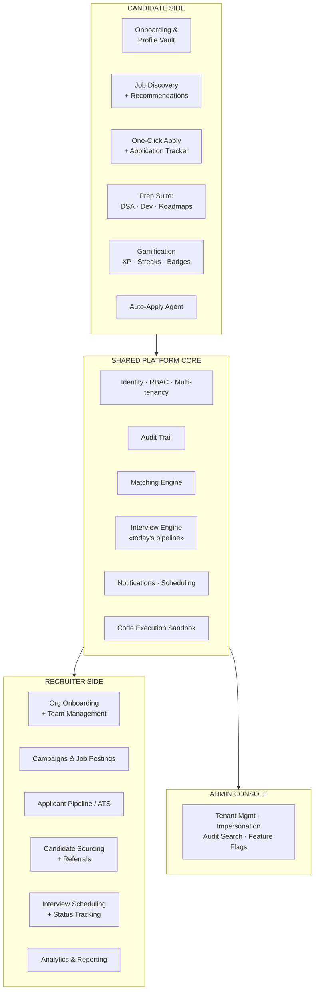
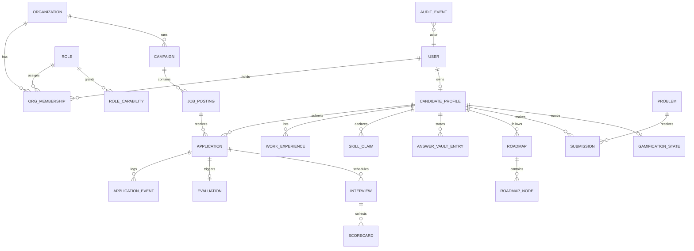
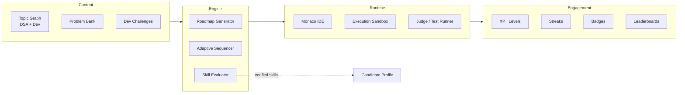
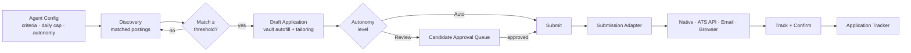

# Evalia Product Blueprint

**Status:** Phases 0–2 are partially implemented; Phase 3 and later remain proposed. See the [2026-09-29 implementation audit](PHASE_0_2_IMPLEMENTATION_AUDIT.md). This blueprint describes target state, not current product capability.
**Supersedes in scope:** [PRODUCTION_ROADMAP.md](../PRODUCTION_ROADMAP.md), which hardens the *existing* interview pipeline. This document defines the product Evalia becomes around it.
**Companion:** [DECISIONS.md](DECISIONS.md) — the choices that must be made before Phase 0 code is written.

---

## 1. The core reframe

The original Evalia baseline was **one linear pipeline**: paste a resume → three agent-evaluated rounds → a committee verdict. Since then, an authenticated candidate/recruiter marketplace, deterministic matching, invitations, scheduled interviews, and a human-reviewed application screening stage have been added alongside the legacy pipeline. The implementation is still partial: RLS, calendar integrations, resume parsing/upload, full durable stage execution, and the Phase 3 prep suite remain open. See the [implementation audit](PHASE_0_2_IMPLEMENTATION_AUDIT.md) for source and test evidence.

The product being described is fundamentally different in shape. It is a **two-sided talent platform** where the agent pipeline is one feature among many, not the product itself:



The single most important consequence: **every table, every endpoint, and every query must become tenant-and-actor aware before anything else is built.** Retrofitting multi-tenancy and RBAC onto a working feature set is one of the most expensive mistakes possible in this kind of product. That is why Phase 0 below is non-negotiable and comes first.

---

## 2. Personas and the role model

### 2.1 Actors

| Persona | Scope | Primary jobs-to-be-done |
|---|---|---|
| **Platform Admin** | Global (Evalia staff) | Tenant lifecycle, abuse response, audit search, feature flags, support impersonation |
| **Org Owner** | One organization | Billing, org settings, invite/remove admins, delete org |
| **Org Admin** | One organization | Team management, role assignment, org-wide settings, view all campaigns |
| **Recruiter** | Assigned campaigns | Create campaigns, manage pipeline, source candidates, schedule interviews, send referrals |
| **Hiring Manager** | Assigned campaigns | Review shortlists, approve/reject, define role requirements, final decision authority |
| **Interviewer** | Assigned interviews only | Conduct/review a specific interview, submit scorecard. Cannot see other candidates' data |
| **Candidate** | Own data only | Build profile, discover + apply to jobs, track applications, use prep suite |

### 2.2 Why role-based alone is insufficient

A recruiter at Acme must not see Globex's candidates. A recruiter on the "Backend Hiring" campaign should not necessarily see the "Executive Search" campaign. An interviewer assigned to one candidate must not browse the full applicant pool.

So the authorization model needs **three layers**, checked in order:

```
1. TENANT   — does actor.org_id match resource.org_id?        (hard boundary)
2. ROLE     — does actor's role grant this capability?         (capability check)
3. RESOURCE — is actor assigned to this specific object?       (scoped grant)
```

Capabilities are explicit strings, never inferred from role names in business logic:

```
campaign:create      campaign:read:own     campaign:read:org     campaign:delete
application:read     application:advance   application:reject
interview:schedule   interview:conduct     interview:read:assigned
candidate:search     candidate:refer       candidate:export
org:member:invite    org:member:role:set   org:settings:write
audit:read           admin:impersonate     admin:tenant:manage
```

A role is a named bundle of capabilities, stored in the database (not hardcoded), so custom roles become possible later without a code change.

### 2.3 Two distinct account types

Candidates and org members are **different account types on the same identity**. A person can be a candidate at Acme and a recruiter at their own employer. The model must be:

```
User (identity: email, auth credentials, name)
 ├── CandidateProfile  (0 or 1)  — their job-seeker identity
 └── OrgMembership[]   (0 or N)  — (user, org, role) tuples
```

Never model this as a `user.type` column. That decision blocks the dual-persona case permanently.

---

## 3. Domain model

The current four tables (`evaluations`, `agent_verdicts`, `interview_questions`, `interview_answers`) become a small subsystem inside a much larger model.



### 3.1 New table groups

**Identity & access**
`users`, `organizations`, `org_memberships`, `roles`, `role_capabilities`, `invitations`, `sessions`

**Candidate profile (the "fill once" vault)**
`candidate_profiles`, `work_experiences`, `education`, `skill_claims`, `projects`, `documents` (resumes/portfolios), `answer_vault_entries` (reusable answers to common application questions), `job_preferences` (locations, comp band, remote, visa)

**Hiring**
`campaigns`, `job_postings`, `posting_requirements`, `applications`, `application_events`, `application_stages`, `interviews`, `interview_participants`, `scorecards`, `referrals`, `talent_pool_entries`

**Prep suite**
`problems`, `problem_test_cases`, `submissions`, `submission_results`, `challenges` (dev/project-based), `roadmaps`, `roadmap_nodes`, `node_progress`, `topic_graph`

**Engagement**
`gamification_state`, `xp_events`, `badges`, `user_badges`, `streaks`, `leaderboard_snapshots`

**Platform**
`audit_events`, `notifications`, `feature_flags`, `background_jobs`

### 3.2 Universal columns

Every tenant-scoped table carries:

| Column | Purpose |
|---|---|
| `org_id` | Tenant boundary. Indexed, foreign-keyed, and part of every composite index |
| `created_at` / `updated_at` | Standard |
| `created_by` / `updated_by` | Actor attribution, feeds the audit trail |
| `deleted_at` | Soft delete — hard deletes destroy audit integrity |
| `version` | Optimistic concurrency for anything a human edits |

### 3.3 Postgres Row-Level Security as defense in depth

Application-layer tenant checks will eventually be missed by someone. RLS makes that a failed query instead of a data breach:

```sql
ALTER TABLE applications ENABLE ROW LEVEL SECURITY;

CREATE POLICY tenant_isolation ON applications
  USING (org_id = current_setting('evalia.current_org_id')::int);
```

This requires setting the session variable per request and is **incompatible with naive connection pooling** — the variable must be set and reset inside the same checked-out connection. That constraint is a real cost and is flagged in [DECISIONS.md](DECISIONS.md).

---

## 4. Audit trail

The requirement is "audit trails for each and every function." That needs a precise definition or it becomes either useless noise or a performance disaster.

### 4.1 What gets audited

| Tier | Examples | Retention |
|---|---|---|
| **Tier 1 — Security & decisions** (always, immutable) | Login, role change, permission grant, application advance/reject, hire decision, data export, impersonation, candidate data access by recruiter | 7 years |
| **Tier 2 — Business mutations** (always) | Campaign created/edited, job published, interview scheduled/cancelled, scorecard submitted, profile updated | 2 years |
| **Tier 3 — Reads of sensitive data** (sampled + always for PII) | Recruiter viewed candidate profile, resume downloaded | 1 year |
| **Not audited** | Page views, prep-suite navigation, non-sensitive list queries | — |

### 4.2 Event shape

```json
{
  "id": "evt_01HQ...",
  "occurred_at": "2026-09-28T10:14:22.481Z",
  "actor": { "user_id": 42, "org_id": 7, "role": "recruiter",
             "ip": "203.0.113.9", "user_agent": "...", "impersonated_by": null },
  "action": "application.rejected",
  "resource": { "type": "application", "id": 8891, "org_id": 7 },
  "subject": { "type": "candidate_profile", "id": 3310 },
  "before": { "stage": "technical_interview" },
  "after":  { "stage": "rejected", "reason_code": "insufficient_experience" },
  "context": { "request_id": "req_...", "campaign_id": 55 },
  "prev_hash": "sha256:...",
  "hash": "sha256:..."
}
```

### 4.3 Making it tamper-evident

An append-only table alone is not an audit system — a DBA can `UPDATE` it. Practical hardening, in increasing order of cost:

1. **Hash chaining** — each event includes the prior event's hash. Silent edits become detectable.
2. **Database-enforced append-only** — revoke `UPDATE`/`DELETE` on `audit_events` from the application role entirely; writes go through an `INSERT`-only grant.
3. **Periodic anchoring** — write a signed daily digest to separate storage (different credentials, object-lock enabled).

Be honest in documentation: 1+2 gives *tamper evidence*, not *tamper proofing*. Only 3 resists a fully-privileged insider.

### 4.4 Implementation approach

Auditing must not be something a developer can forget. Two mechanisms:

- **Declarative decorator** on route handlers for intent-level events:
  ```python
  @router.post("/applications/{id}/reject")
  @audited("application.rejected", resource="application", capture=["reason_code"])
  async def reject_application(...): ...
  ```
- **Repository-layer hooks** for data-level events, so any write through the persistence layer emits a Tier-2 record automatically.

Audit writes go to a **queue, not the request path**, with a durable local buffer — an audit outage must never take down the product, but an audit *gap* must be detectable.

---

## 5. Recruiter experience

### 5.1 Campaign model

A **Campaign** is a hiring initiative (e.g. "Q4 Backend Expansion"). It owns one or more **Job Postings**, shares a team, budget, and reporting rollup.

```
Campaign "Q4 Backend Expansion"
 ├── Job Posting: Senior Backend Engineer (Bangalore, Hybrid)
 ├── Job Posting: Backend Engineer II (Remote, India)
 └── Team: 2 recruiters, 1 hiring manager, 4 interviewers
```

### 5.2 Configurable pipeline

Hard-coding the 5-stage agent pipeline as *the* hiring process is a demo assumption. Real orgs need per-posting stage definitions:

```
[Applied] → [AI Screen] → [Technical Assessment] → [Human Interview] → [Offer] → [Hired]
                 ↓                  ↓                      ↓
             [Rejected]        [Rejected]             [Rejected]
```

Each stage declares: type (`automated` | `human` | `hybrid`), entry criteria, SLA, auto-advance rules, and who is notified. The existing agent pipeline becomes the implementation of `automated` stages — genuinely valuable, but now optional and configurable rather than mandatory.

### 5.3 Recruiter workspace surfaces

| Surface | Contents |
|---|---|
| **Dashboard** | Campaigns needing attention, SLA breaches, today's interviews, new applications, funnel health |
| **Campaign view** | Kanban pipeline by stage, bulk actions, filters (score, skills, experience, status) |
| **Candidate detail** | Unified profile, application history, all agent verdicts, human scorecards, interview recordings/notes, activity timeline |
| **Sourcing** | Search the talent pool, ranked "best fit" candidates for a posting, saved searches, outreach |
| **Interviews** | Calendar, scheduling with availability matching, panel assignment, reschedule/cancel |
| **Referrals** | Refer a candidate to another campaign or (with consent) partner org |
| **Analytics** | Time-to-hire, funnel conversion, source effectiveness, interviewer calibration, **bias monitoring** |

### 5.4 Bias monitoring is not optional

A platform making hiring recommendations must measure its own disparate impact. Minimum viable: track selection rates across stages by available attributes, surface material divergence to org admins, and make the evidence exportable. This is both an ethical requirement and, in many jurisdictions (NYC LL 144, EU AI Act high-risk classification), a legal one. See [DECISIONS.md](DECISIONS.md) — this materially affects go-to-market geography.

---

## 6. Candidate experience

### 6.1 Onboarding — progressive, not a wall

The fastest way to lose candidates is a 30-field form before any value is delivered.

```
Step 1  Email + password/OAuth                          → account exists
Step 2  Resume upload → parsed into a draft profile     → most fields pre-filled
Step 3  Confirm/correct parsed data (name, experience)  → profile usable
Step 4  Job preferences (role, location, comp, remote)  → recommendations unlock
        ────────── can browse and apply from here ──────────
Step 5+ Progressive enrichment prompted in context:
        - Skills assessment when applying to a matched role
        - Answer vault entries captured on first application, reused after
        - Portfolio/projects when a posting requests them
```

**Resume parsing is the highest-leverage onboarding investment.** It converts a 20-minute form into a 2-minute confirmation. The existing screening agent already extracts skills and experience — that capability gets repurposed here.

### 6.2 The Profile Vault — "fill it once"

Core requirement: candidates must never re-enter the same information.

```
ANSWER VAULT
├── Identity          name, contact, location, work authorization
├── Experience        roles, dates, descriptions, achievements
├── Education         degrees, institutions, dates
├── Skills            claimed + verified (via prep-suite performance)
├── Documents         resumes (multiple versions), cover letters, portfolio
├── Standard answers  "Why this company?" · "Salary expectations?"
│                     "Notice period?" · "Visa status?" · EEO responses
└── Preferences       target roles, locations, comp band, remote policy
```

Application flow becomes: **posting requirements → vault auto-fill → candidate reviews a pre-filled form → submit.** Any genuinely new question asked is captured back into the vault for next time. The vault gets measurably better with each application — that compounding value is the retention mechanic.

### 6.3 Candidate surfaces

| Surface | Contents |
|---|---|
| **Home** | Recommended jobs, upcoming interviews, application status changes, prep streak, next roadmap task |
| **Job discovery** | Search + filters, personalized ranking, match explanation ("8/10 — strong Python/FastAPI overlap, missing Kubernetes"), save/track |
| **Applications** | Status tracker with real stage visibility, timeline, actions needed, withdraw |
| **Interviews** | Upcoming schedule, join links, prep materials tailored to that role, post-interview feedback |
| **Prep suite** | See §7 |
| **Profile** | Vault management, resume versions, visibility settings, privacy controls |

### 6.4 Application status transparency

Candidates overwhelmingly cite "the black hole" as the worst part of job hunting. Showing real pipeline state is a genuine differentiator — but requires recruiter-side controls, since orgs will not expose every internal stage. Model: each stage has a `candidate_visible_label` and a `visibility` flag, so `Internal: "Hiring manager review — awaiting VP approval"` can surface as `Candidate: "Under review"`.

---

## 7. Interview & placement prep suite

This is effectively a second product. It deserves explicit architecture.

### 7.1 Component map



### 7.2 The topic graph is the foundation

Personalized roadmaps generated freely by an LLM will hallucinate prerequisites and produce incoherent sequences. The correct design is a **curated DAG of topics with explicit prerequisites**, where the LLM *selects and sequences within* that graph rather than inventing it:

```
Arrays → Two Pointers → Sliding Window
   ↓                         ↓
Hashing ────────────→ Prefix Sums
   ↓
Sorting → Binary Search → Search on Answer
```

Each node carries: prerequisites, difficulty, estimated hours, linked problems, canonical explanation, and interview frequency weighting. Roadmap generation then becomes a **constrained, verifiable planning problem** — pick a target (role + timeline + current skill), traverse the DAG, allocate time, schedule. The LLM personalizes narrative and emphasis; the graph guarantees correctness.

### 7.3 Two distinct practice modes

| | **DSA Mode** | **Development Mode** |
|---|---|---|
| Problem shape | Single function, fixed signature | Multi-file project, real repo |
| Editor | Monaco, single file | Monaco multi-file / full workspace |
| Execution | Stdin/stdout, short-lived, hard resource caps | Long-running, dependencies, a dev server |
| Grading | Deterministic test cases, complexity checks | Test suite + linting + LLM code review against a rubric |
| Example | "Two Sum" | "Build a rate-limited REST API with auth and tests" |

These have **materially different infrastructure requirements** and should not share one execution backend. DSA needs a fast, tightly-sandboxed, ephemeral runner. Dev mode needs a container with a filesystem, package installs, and minutes of runtime.

### 7.4 Code execution — the highest-risk component

Running arbitrary user-submitted code is the single most dangerous thing this platform will do. Non-negotiable requirements:

- **Never on the API host.** Separate infrastructure, separate network, separate credentials.
- **No network egress** from the sandbox by default (prevents exfiltration and crypto-mining).
- **Hard resource limits** — CPU, memory, wall-clock, process count, file descriptors, output size.
- **Ephemeral, disposable filesystem** — fresh per execution.
- **No production credentials** reachable, ever.
- **Per-user and global rate/quota limits** — compute is a real cost and an abuse vector.

Realistic options, with honest trade-offs:

| Option | Pros | Cons | Fit |
|---|---|---|---|
| **Judge0** (self-hosted) | Battle-tested, 60+ languages, purpose-built | Operational burden, DSA-shaped only | Strong default for DSA mode |
| **Piston** | Simpler, lighter | Fewer features, smaller community | Viable DSA alternative |
| **Firecracker microVMs** | Strongest isolation, flexible | Significant engineering investment | Right answer at scale, wrong one at start |
| **WebContainers (StackBlitz)** | Runs in-browser, zero server cost, instant | Node/JS ecosystem only | Excellent for JS/TS dev challenges |
| **Managed (Sphere Engine, etc.)** | Zero ops | Per-execution cost, vendor lock-in, data residency | Fastest path to launch |

**Recommendation:** start with a managed provider or self-hosted Judge0 for DSA, and WebContainers for JS-based dev challenges. Defer custom Firecracker infrastructure until execution volume actually justifies it. This decision is in [DECISIONS.md](DECISIONS.md).

### 7.5 Gamification — with a deliberate guardrail

Mechanics: XP per solved problem (difficulty-weighted), levels, daily streaks with forgiveness tokens, badges for milestones and consistency, opt-in leaderboards (global, peer-group, company), and skill-tree visualization of topic-graph mastery.

**The guardrail that matters:** prep-suite performance must feed candidate profiles as *verified skill signals* — but must never silently become a hiring ranking factor without disclosure. A candidate with more free time to grind problems is not necessarily a better engineer, and encoding that into match scores is exactly how a platform launders bias into hiring outcomes. Verified skills should be shown as evidence to humans, weighted conservatively in matching, and documented transparently.

---

## 8. Matching & recommendation engine

Bidirectional: jobs→candidates and candidates→jobs, sharing one scoring core.

### 8.1 Deliberately staged sophistication

**Stage 1 — Deterministic (launch with this).** Explainable, debuggable, no training data required:

```
score = w₁·skill_overlap      (required vs. claimed/verified)
      + w₂·experience_fit     (years vs. band, penalize over/under)
      + w₃·location_fit       (incl. remote policy, relocation willingness)
      + w₄·comp_alignment     (expectation vs. range)
      + w₅·recency            (activity, profile freshness)
      - penalties             (hard filters: visa, notice period, already applied)
```

**Stage 2 — Semantic (add once there is content volume).** Embed job descriptions and profiles, store in `pgvector`, blend cosine similarity into the score. Captures "Django experience ≈ Flask experience" that keyword overlap misses.

**Stage 3 — Learned ranking (only with real outcome data).** Train on actual outcomes — applications that advanced, interviews that converted, offers accepted. **This requires thousands of labeled outcomes that do not exist yet.** Planning for it now is correct; claiming it at launch would not be.

### 8.2 Explainability is a product feature

Every recommendation ships with its reasoning:

> **Match 8.4/10** — Strong overlap on Python, FastAPI, PostgreSQL. 5 years vs. 4–7 required. Remote-friendly matches your preference. **Gap:** posting lists Kubernetes; not on your profile. *[Add it] [Practice it]*

That last call-to-action closes the loop between the hiring side and the prep side — the structural advantage of having both in one product.

---

## 9. Job application agent (auto-apply)

The "apply to everything for me" agent. High user value, and the area with the most serious non-technical risk.

### 9.1 Architecture



### 9.2 Submission adapters, in strict preference order

1. **Native Evalia postings** — a direct database write. Perfect fidelity, zero risk.
2. **Official ATS APIs** — Greenhouse, Lever, Ashby, Workable all have partner APIs. Sanctioned, reliable, the correct path for scale.
3. **Email applications** — where the posting specifies an address.
4. **Browser automation (Playwright)** — last resort only.

### 9.3 Honest risks that must shape the design

- **Terms of Service.** Automated submission to third-party job boards frequently violates their ToS. LinkedIn in particular has litigated aggressively. Scraping-based auto-apply is a genuine legal exposure, not a technical footnote.
- **Quality collapse.** Mass low-effort applications degrade outcomes for the candidate and poison the well for recruiters. Volume caps and per-application tailoring are product requirements, not polish.
- **Brittleness.** Browser automation against third-party forms breaks constantly and needs ongoing maintenance budget.
- **Consent and attribution.** Every auto-submitted application must be clearly marked as agent-assisted in Evalia's own records, and the candidate must retain a complete, auditable record of what was sent on their behalf.

**Recommended posture:** ship adapters 1 and 2 (native + official APIs) as the supported product. Treat browser automation as an explicitly experimental, user-consented, review-required mode — or defer it entirely pending legal review. This is a business decision, flagged in [DECISIONS.md](DECISIONS.md).

---

## 10. Admin console

| Capability | Notes |
|---|---|
| Tenant management | Create/suspend/delete orgs, seat limits, plan assignment |
| User management | Search across tenants, lock accounts, force password reset, resolve duplicate identities |
| **Impersonation** | Time-boxed, reason-required, loudly banner-flagged in the UI, always audited, never silent |
| Audit explorer | Full-text + faceted search, export, integrity verification (hash-chain check) |
| Feature flags | Per-tenant and per-user rollout control |
| Content moderation | Review reported postings, fraudulent orgs, abusive candidates |
| Ops dashboard | Job queue depth, agent failure rates, execution-sandbox usage, LLM spend by tenant |
| Data subject requests | Export/delete a user's data across all tables (GDPR/DPDP compliance) |

Impersonation deserves emphasis: it is the highest-privilege operation in the product. Requiring a written reason, capping duration, showing a persistent banner, and writing both start and end events to the Tier-1 audit log should all be enforced in code, not policy.

---

## 11. Platform services

Several cross-cutting services must exist for any of the above to work reliably.

### 11.1 Background job system

Currently agent calls block the HTTP request. At product scale this is untenable — auto-apply runs, bulk imports, recommendation recomputation, notification fanout, and report generation are all inherently asynchronous.

Minimum viable: a Postgres-backed job table with atomic claims, leases, heartbeats, bounded retry with jitter, and a dead-letter queue. Graduate to SQS/Celery when operational reality demands it. (This is `PRODUCTION_ROADMAP.md` P2, now a hard prerequisite rather than a nice-to-have.)

### 11.2 Notifications

Multi-channel (in-app, email, optionally SMS/push) with per-user preferences, digest batching, and templates. Triggered by domain events — application status change, interview scheduled, new match, streak at risk, recruiter message.

### 11.3 Scheduling

Interview scheduling with calendar integration (Google/Microsoft), availability collection, timezone correctness, panel coordination, reschedule/cancel flows, and reminders. Timezone bugs in scheduling are uniquely damaging to user trust — this needs real test coverage.

### 11.4 Search

Postgres full-text search is sufficient at launch for jobs and candidates. The trigger to move to OpenSearch/Elasticsearch is faceted search across large candidate pools with low-latency requirements — not before.

### 11.5 File storage

Resumes, portfolios, recordings, exports. Object storage with presigned URLs, virus scanning on upload, strict content-type validation, and per-object access control tied to the RBAC layer. **Resumes are sensitive personal data** — no public-CDN paths, ever.

---

## 12. Delivery plan

Each phase ends with something usable. Estimates assume a small focused team and are planning aids, not commitments.

### Phase 0 — Foundation *(prerequisite for everything)*

> Nothing else can be built safely until this exists. Retrofitting tenancy and RBAC later means rewriting every query and every endpoint.

- Identity: registration, login, sessions, password reset, OAuth
- `users`, `organizations`, `org_memberships`, `roles`, `role_capabilities`
- Capability-based authorization middleware + resource-scoped checks
- Tenant isolation on every query, with RLS as defense in depth
- Audit event infrastructure (decorator + repository hooks + hash chain)
- Background job system
- Migration framework (Alembic) — replacing today's `CREATE TABLE IF NOT EXISTS`
- **Retrofit the existing interview pipeline** onto the new tenancy/RBAC model
- Negative authorization tests as a CI gate

**Exit:** two orgs can coexist with zero data leakage, proven by tests. Every privileged action produces an audit record.

### Phase 1 — Core two-sided marketplace

- Candidate onboarding + resume parsing + Profile Vault
- Recruiter/org onboarding + team invitations
- Campaigns, job postings, configurable pipeline stages
- Job discovery + one-click apply from vault
- Application tracker (candidate) and applicant pipeline (recruiter)
- Interview scheduling + status tracking
- Notifications
- Existing agent pipeline wired in as an `automated` stage

**Exit:** a real company can post a job, a real candidate can apply, and both sides can track it end to end.

### Phase 2 — Intelligence

- Deterministic matching engine, both directions
- Recommendation surfaces with explanations
- Candidate sourcing + talent pool search
- Referrals
- Recruiter analytics + **bias monitoring**
- Semantic matching via pgvector

**Exit:** both sides receive ranked, explained recommendations that measurably outperform chronological listing.

### Phase 3 — Prep suite

- Topic graph + problem bank (DSA)
- Monaco IDE + execution sandbox + judge
- Roadmap generation (constrained by the topic graph) + adaptive sequencing
- Development challenges with project-based grading
- Gamification: XP, streaks, badges, leaderboards
- Verified skills flowing into profiles

**Exit:** a candidate can follow a personalized roadmap, solve problems in-browser, and surface verified skills to recruiters.

### Phase 4 — Agents & automation

- Auto-apply agent with native + ATS API adapters
- Approval queue and autonomy controls
- Interview prep agent (role-specific, mock interviews)
- ATS integrations (Greenhouse, Lever, Ashby)

### Phase 5 — Admin, scale & compliance

- Full admin console incl. audited impersonation
- Data subject request tooling (export/delete)
- Bias monitoring reports + compliance exports
- Performance work, caching, search migration if warranted

### Future scope — Monetization *(parked, as requested)*

Deliberately deferred. Recorded now so the architecture does not preclude it:

- **Candidate:** free core (profile, apply, track, basic prep) — the acquisition engine. Paid tier for auto-apply volume, advanced prep, AI mock interviews, priority visibility.
- **Recruiter/org:** seat-based or posting-based, tiered by active postings, team size, AI evaluation volume, analytics depth, ATS integrations.
- **Trial:** time-boxed org trial with full features and usage caps; candidate side free-forever core with metered premium features.
- **Architecture hooks to include from Phase 0:** a `plan` on organizations, a usage-metering table, and feature flags keyed to plan — so billing can be added later without schema surgery. Payment provider (Stripe/Razorpay) chosen at that point.

---

## 13. What changes for the existing code

| Current | Becomes |
|---|---|
| `evaluations` table as root entity | `applications` is the root; `evaluations` becomes an artifact of an automated pipeline stage |
| Authenticated candidate/recruiter platform plus token-gated public sandbox | Tenant-and-actor-scoped platform routes; authenticated legacy evaluations require owner/org scope |
| Hardcoded 5-stage pipeline | One configurable pipeline *template*, selectable per posting |
| `AVAILABLE_ROLES` string list | `job_postings` with structured, versioned requirements |
| Resume text pasted per evaluation | Profile Vault, referenced by application |
| Rounds 1–3 run in HTTP requests; finalization has durable-job/recovery foundations but may execute inline | All agent stages admitted through durable jobs with durable state |
| `CREATE TABLE IF NOT EXISTS` plus a small custom migration ledger | Complete, reviewable migrations for all domain changes |
| 202 backend tests; no browser E2E or automated real-Postgres suite | Tenant-isolation, authorization, browser, and PostgreSQL concurrency tests as CI gates |

The agent pipeline itself — strict output validation, bias-isolated committee, per-evaluation verdict storage — is genuinely good work and survives intact. It gets *repositioned* from "the product" to "a differentiated feature inside the product."

---

## 14. Honest assessment

A few things worth stating plainly rather than burying:

1. **This is a multi-quarter program, not a sprint.** Each of Phases 1, 2, and 3 is independently a substantial product. Attempting them in parallel with a small team will produce three half-products.

2. **Phase 0 is genuinely non-negotiable.** It is the least visibly exciting work in this document and the only part that cannot be done later.

3. **Scope-reduction candidates, if time is constrained:** development challenges (keep DSA only), browser-automation auto-apply (keep native + ATS APIs), and learned ranking (keep deterministic + semantic). Each can be deferred without breaking the core loop.

4. **The strongest strategic position** is the closed loop no single-sided competitor has: identify a skill gap during matching → provide targeted practice → verify the skill → surface verified evidence to recruiters → improve the match. That loop should be protected in prioritization even when individual features get cut.

5. **Legal review is required before launch** — not after. Automated hiring decisions, auto-apply against third-party ToS, candidate PII across jurisdictions, and bias-audit obligations (NYC LL 144, EU AI Act) are all live issues that constrain the product, and they are cheaper to design around than to remediate.

---

## 15. Next step

Review [PHASE_0_2_IMPLEMENTATION_AUDIT.md](PHASE_0_2_IMPLEMENTATION_AUDIT.md) and [DECISIONS.md](DECISIONS.md). Phase 0–2 implementation has begun but remains incomplete; the next hardening gates are RLS/real-Postgres proof, explicit consent/retention enforcement, calendar integrations, and full durable stage execution. Phase 3 scope can then be planned, with code execution gated on the sandbox decision in D-03.
